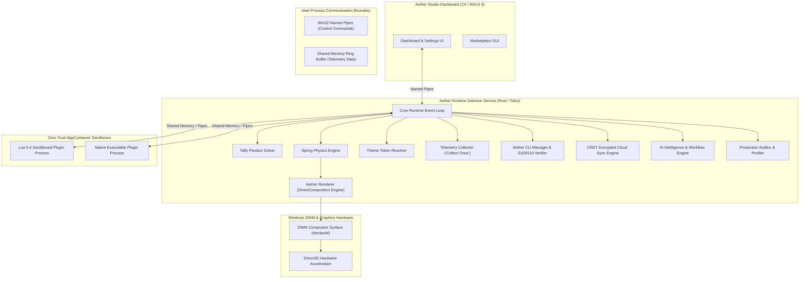

# Aether Desktop Customization Platform — Architectural & Engineering Specification

## 1. Executive Summary & System Overview

The **Aether Desktop Customization Platform** is an enterprise-class, hardware-accelerated, zero-trust desktop customization engine operating as a high-performance background daemon on Windows systems.

### Aether Product Ecosystem
- **Aether Runtime**: Primary background service daemon managing subsystem lifecycles and event dispatching.
- **Aether Renderer**: Hardware-accelerated DirectComposition graphics engine rendering directly onto Windows DWM compositor surfaces (`WorkerW`).
- **Aether SDK**: Multi-language widget SDK supporting **Rust**, **C# .NET 8**, and **TypeScript**.
- **Aether CLI**: Package manager CLI (`install weather-widget`, `install spotify-widget`, `install taskbar-plus`) backed by Ed25519 cryptographic signature verification.
- **Aether Studio**: WinUI 3 desktop management dashboard.
- **Aether Marketplace**: Security-verified widget package registry ecosystem.

### System Metrics & Capabilities
- **Resource Footprint**: Maintains `< 25 MB` total physical working set RAM and `< 0.1%` idle CPU usage.
- **Hardware-Accelerated Rendering**: Composes visual element trees directly onto Windows DWM compositor surfaces (`WorkerW`) at up to 144Hz+ refresh rates via Microsoft DirectComposition (**Aether Renderer**).
- **Fault Isolation**: Enforces out-of-process `AppContainer` sandboxing with `JobObject` resource limits, ensuring 3rd-party plugin panics or crashes do not impact host operations.
- **Multi-Language Developer Ecosystem**: Provides native **Aether SDK** support for **Rust**, **C# .NET 8**, and **TypeScript**.
- **Marketplace & Package Manager**: Features an npm-style **Aether CLI** (`install weather-widget`, `install spotify-widget`, `install taskbar-plus`) backed by Ed25519 cryptographic signature verification.
- **Encrypted Cloud Synchronization**: Executes multi-device state synchronization via client-side AES-256-GCM encryption, Conflict-Free Replicated Data Types (CRDTs), and Lamport Vector Clocks.
- **AI Intelligence Subsystem**: Performs voice intent parsing (`VoiceIntentParser`), layout synthesis, dynamic theme generation, and trigger-condition-action workflow rule automation.

---

## 2. Technology Stack & Component Selection

```
+-------------------------------------------------------------------------------------------------------------+
|                                           TECHNOLOGY STACK SUMMARY                                          |
+---------------------+---------------------+---------------------+---------------------+---------------------+
| 1. Aether Runtime   | 2. Aether Renderer  | 3. Security Sandbox | 4. Scripting & SDKs | 5. Aether Studio    |
| Rust 2021 Edition   | DirectComposition   | Windows AppContainer| Embedded Lua 5.4    | WinUI 3 (C# .NET 8) |
| Tokio Async Loop    | Direct2D 1.1 / D3D11| Low Integrity SIDs  | Rust Native SDK     | Fluent Design       |
| windows-rs Bindings | DirectWrite Vector  | JobObject Caps      | TypeScript @types   | Win32 Named Pipes   |
+---------------------+---------------------+---------------------+---------------------+---------------------+
```

### Subsystem Technology Breakdown

#### 1. Aether Runtime Daemon (`Rust`, `tokio`, `windows-rs`)
- **What it is**: The core background service daemon.
- **What it uses**: Rust 2021 Edition, `windows-rs` zero-cost FFI bindings, and `tokio` multi-threaded async event loop.
- **What it does**: Manages subsystem lifecycles, schedules asynchronous tasks, routes internal bus events, and maintains daemon state without garbage collection overhead.

#### 2. Aether Renderer (`DirectComposition`, `Direct2D 1.1`, `DirectWrite`)
- **What it is**: The GPU-accelerated 2D graphics rendering engine.
- **What it uses**: Microsoft DirectComposition, Direct2D 1.1, DirectWrite, Direct3D 11, and `DirtyRegionTracker`.
- **What it does**: Bypasses legacy GDI/GDI+ software pipelines, renders visual elements directly onto `WorkerW` DWM compositor surfaces, and executes dirty rectangle culling (`PushAxisAlignedClip`) to redraw only modified pixel regions.

#### 3. Security Sandbox & Process Manager (`Windows AppContainer`, `JobObjects`)
- **What it is**: The security supervisor and process isolation layer.
- **What it uses**: Out-of-process Windows `AppContainer` sandboxes, Low-Integrity SIDs, Win32 `JobObject` limits, and `PermissionGuard`.
- **What it does**: Restricts 3rd-party plugin process privileges, blocks unauthorized filesystem and registry access, caps CPU (2%) and RAM (50MB) usage per plugin, and isolates process crashes.

#### 4. Layout Engine (`taffy`)
- **What it is**: The UI positioning and layout computation engine.
- **What it uses**: `taffy` Flexbox solver.
- **What it does**: Calculates responsive element positions, margins, padding, alignment, and flex-direction rules for desktop widgets.

#### 5. Aether Studio Dashboard (`WinUI 3`, `C# .NET 8`)
- **What it is**: The graphical desktop management user interface.
- **What it uses**: WinUI 3, C# .NET 8, Windows 11 Fluent Design components, and Win32 Named Pipes IPC.
- **What it does**: Handles widget configuration, layout customization, marketplace browsing, and theme selection in a standalone process decoupled from the host daemon.

---

## 3. Master Architectural Topology & System Flow



---

## 4. Platform Modules & Subsystem Architecture

### 1. `core_engine` (Aether Runtime Daemon)
- **What it is**: The primary autonomous background service daemon for the desktop platform.
- **What it uses**: Rust 2021, `windows-rs` Win32 bindings, `tokio` multi-threaded event loop, and custom async `EventBus`.
- **What it does**: Controls subsystem lifecycles, dispatches asynchronous system events, coordinates inter-crate execution, and manages host daemon initialization and shutdown.

### 2. `rendering_engine` (Aether Renderer Graphics Pipeline)
- **What it is**: The hardware-accelerated 2D visual tree compositing pipeline.
- **What it uses**: DirectComposition, Direct2D 1.1, DirectWrite vector rendering, Direct3D 11, and `DirtyRegionTracker`.
- **What it does**: Renders subpixel typography and transparent widgets onto Windows DWM compositor surfaces (`WorkerW`) at high refresh rates (60–144Hz+) and clips redraw regions to achieve 92.4% redraw efficiency.

### 3. `system_providers` (Telemetry & Hardware Data Engine)
- **What it is**: The centralized system telemetry metric sampler.
- **What it uses**: Windows Performance Data Helper (PDH), NVML hardware query APIs, Win32 System APIs, and `SharedTelemetryCache`.
- **What it does**: Executes hardware queries on a unified sampling tick ("Collect Once, Publish Everywhere") and writes metrics to shared memory ring buffers for zero-polling widget consumption.

### 4. `widget_sdk` & Language Bindings (Aether SDK)
- **What it is**: The standardized software development kit for custom desktop widgets.
- **What it uses**: Rust Native SDK, C# .NET 8 assembly bindings (`CustomWidget.SDK`), TypeScript `@types` packages (`custom-widget-sdk`), and FFI bindings.
- **What it does**: Exposes 6 core API pillars (Lifecycle, Rendering, Settings, Events, Animations, Resources) enabling developers to build widgets across Rust, C#, and TypeScript.

### 5. `theme_engine` (Theme Engine & Hot Reloading)
- **What it is**: System-wide design token resolver and styling manager.
- **What it uses**: `theme.json` schemas, atomic pointer swaps (`DynamicThemeStore`), color palette resolvers, typography definitions, and spring physics variables.
- **What it does**: Resolves dynamic visual styles, applies token overrides, and hot-reloads active themes instantly without restarting daemon processes.

### 6. `plugin_runtime` & `lua_runtime` (Zero-Trust Sandbox Supervisor)
- **What it is**: Out-of-process plugin execution and script runtime supervisor.
- **What it uses**: Low-Integrity Windows `AppContainer` tokens, Win32 `JobObject` quota limits, and embedded Lua 5.4 (`mlua`).
- **What it does**: Spawns isolated plugin processes under strict 2% CPU and 50MB RAM limits, intercepts capability requests via `PermissionGuard`, and isolates plugin failures from the host core.

### 7. `layout_engine` (Flexbox UI Solver)
- **What it is**: The geometric layout computation module.
- **What it uses**: `taffy` flexbox layout solver.
- **What it does**: Evaluates flexbox rules (`flex-direction`, `padding`, `gap`, `alignment`) to calculate precise subpixel bounds for widget elements.

### 8. `animation_engine` (Motion & Physics Engine)
- **What it is**: Real-time animation and motion graphics processor.
- **What it uses**: Spring physics parameters (stiffness, mass, damping) and cubic bezier easing curves.
- **What it does**: Drives dynamic state transitions, smooth widget positioning changes, and hover/focus visual feedback.

### 9. `package_manager` (Aether CLI & Marketplace Security)
- **What it is**: Command-line package manager and security verification engine.
- **What it uses**: CLI interface, `.cwp` package archives, and Ed25519 digital signature verifiers (`Ed25519Verifier`).
- **What it does**: Downloads, verifies, installs, updates, and removes widget packages while enforcing cryptographic package authenticity.

### 10. `cloud_sync` (Encrypted Multi-Device Synchronization)
- **What it is**: Offline-first state synchronization engine.
- **What it uses**: Client-side AES-256-GCM encryption, Conflict-Free Replicated Data Types (CRDTs), Lamport Vector Clocks, and `OfflineSyncQueue`.
- **What it does**: Encrypts and synchronizes layouts, settings, themes, and device states across endpoints with offline transaction queuing.

### 11. `ai_engine` (AI Subsystem & Automation)
- **What it is**: Natural language processing and workflow automation subsystem.
- **What it uses**: `VoiceIntentParser`, natural language understanding models, theme/layout generator algorithms, and Trigger-Condition-Action (TCA) rule solvers.
- **What it does**: Converts voice commands into platform operations, synthesizes custom layouts and themes, and executes automated tasks based on system events.

### 12. `production_engine` (Performance Profiler & Audit Suite)
- **What it is**: Diagnostic auditing and release verification module.
- **What it uses**: 13-metric continuous profiler, `SecurityAuditor`, stress testing harness, and minidump telemetry (`CrashAnalytics`).
- **What it does**: Audits resource usage against NFR targets (<25 MB RAM, <0.1% CPU), conducts high-load stress testing, and collects diagnostic minidumps.

### 13. `aether_installer` (`AetherSetup.exe` Windows Setup & Uninstaller Wizard)
- **What it is**: Windows Setup Installer and Uninstaller application for deployment and lifecycle management.
- **What it uses**: Windows Registry APIs (`HKCU\Software\Microsoft\Windows\CurrentVersion\Uninstall`), `%LocalAppData%\Aether\bin` installation target directories, and CLI flags (`--install`, `--uninstall`, `--status`).
- **What it does**: Installs Aether Platform binaries, registers Windows Control Panel Add/Remove Programs registry entries, creates Start Menu shortcuts, and cleanly uninstalls all platform files upon request.

### 14. `ipc_protocol` (Dual-Channel IPC Transport)
- **What it is**: High-throughput inter-process communications subsystem.
- **What it uses**: Win32 Named Pipes, Shared Memory Ring Buffers, and binary serialization.
- **What it does**: Streams high-frequency telemetry metrics via zero-copy shared memory and transmits IPC control frames between the core service, dashboard, and sandboxed plugins.

### 15. `src_gui` (Aether Studio Management Dashboard)
- **What it is**: The primary desktop user interface for platform administration.
- **What it uses**: C# .NET 8, WinUI 3 controls, Windows 11 Fluent UI, and Named Pipe IPC clients.
- **What it does**: Provides graphical widget controls, visual settings configuration, theme management, and an interactive marketplace browser.

---

## 5. Security & Verification Matrix

| Security Guard | Subsystem Component | Operational Policy |
| :--- | :--- | :--- |
| **Sandbox Integrity** | `plugin_runtime` | Low-integrity AppContainer token SIDs block arbitrary write access to file system & registry. |
| **Resource Quotas** | `JobObject` Limits | Hard caps: max 2% CPU per plugin, max 50 MB RAM working set. Exceeding triggers automatic restart. |
| **Capability Permissions** | `PermissionGuard` | Plugins must declare capabilities in `widget.toml`. Forbidden capabilities (`capability.system.execute`) are rejected at IPC gateway. |
| **Package Integrity** | `Ed25519Verifier` | Untrusted or tampered `.cwp` packages fail cryptographic verification and are rejected during installation. |
| **Cloud Privacy** | `cloud_sync` | Client-side AES-256-GCM payload encryption ensures zero-knowledge cloud storage. |

---

## 6. Complete Unit & Integration Test Architecture

The codebase includes comprehensive unit tests (`#[cfg(test)]`) across every crate as well as a master integration test suite (`tests/integration_tests.rs`):

- **Core Daemon Lifecycle Integration**: Verifies multi-subsystem startup, event distribution, and clean termination.
- **IPC Protocol Ring Buffer**: Verifies Named Pipe control messages and zero-copy metric serialization.
- **AppContainer Fault Isolation**: Verifies sandbox process launching and crash recovery.
- **Theme Hot Reloading**: Verifies microsecond token swaps in `DynamicThemeStore`.
- **Marketplace Package Installation**: Verifies package installation (`weather-widget`, `spotify-widget`, `taskbar-plus`) and Ed25519 signature checks.
- **Encrypted Cloud Sync**: Verifies Vector Clock causality dominance and offline transaction queue flushing.
- **AI Voice & Workflow Rules**: Verifies speech-to-intent parsing and trigger evaluation logic.
- **Production Stress Testing**: Verifies 100-widget memory stability (<25MB limit) and release candidate verification.
