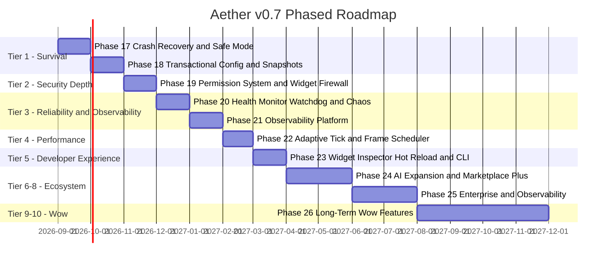

# Aether — v0.7 Release Plan

**Document Status: Design Blueprint (Not Yet Scheduled for Implementation)**  
**Target Version: 0.7.0**  
**Based on: v0.6.0 (Phase 16 — Diagnostics & Integration, 121/121 tests)**  
**Author: Architecture Review**  
**Date: August 2026**

> [!IMPORTANT]
> This document is a **pure design plan**. No code exists for any item below. Implementation
> phases are numbered as Phases 17–26 continuing the existing roadmap. Each phase must follow the
> standard workflow: architecture → tests → implementation → benchmarks → docs → security review.

---

## Overview

v0.7 transforms Aether from a **Production Release Candidate** into a **true production platform** —
one that earns user trust through bulletproof reliability, earns developer trust through superb
tooling, earns enterprise trust through security depth, and earns public enthusiasm through
"wow" features that no competing desktop customization tool (Rainmeter, Komorebi, GlazeWM) offers.

The plan is structured in **10 Priority Tiers** mapped to **10 implementation Phases (17–26)**.
The architecture invariants from AGENTS.md and Architecture docs hold for all phases.



---

## Priority 1 — Survival: Crash Recovery & Configuration Safety

> Engine is alive. Widgets may die. Users must never lose work.

### Phase 17 — Crash Recovery Manager & Safe Mode

**New Crate**: `crates/recovery_manager/`

#### 17.1 Crash Recovery Manager

The existing `plugin_runtime` supervisor restarts crashed plugins with exponential backoff
(3 attempts, 1s/2s/4s). Phase 17 elevates this to a dedicated, first-class `RecoveryManager`
subsystem with the full crash loop lifecycle:

```
Widget panics / exits non-zero
        |
        v
RecoveryManager records crash event + timestamp
        |
        v
Attempt 1-3: Restart with exponential backoff (1s -> 2s -> 4s)
        |
        v  (if crash_count >= 5 within 60s window)
Crash Loop Detected
        |
        +---> Quarantine widget (move to WidgetState::Quarantined)
        +---> Emit CrashLoopEvent via EventBus
        +---> Notify user via IPC diagnostic channel
        +---> Offer rollback to last known-good version
        +---> Keep engine + all healthy widgets alive
```

**Key Types to Design**:

| Type | Location | Responsibility |
|---|---|---|
| `RecoveryManager` | `recovery_manager/src/manager.rs` | Tracks crash history per widget ID, drives the state machine |
| `CrashRecord` | `recovery_manager/src/types.rs` | `widget_id`, `timestamp_ms`, `exit_code`, `crash_count` |
| `CrashPolicy` | `recovery_manager/src/policy.rs` | Configurable: max_crashes, window_secs, backoff_multiplier |
| `QuarantineStore` | `recovery_manager/src/quarantine.rs` | Persists quarantined widget IDs across engine restarts |
| `RollbackCoordinator` | `recovery_manager/src/rollback.rs` | Coordinates with `package_manager` to revert widget version |

**Integration Points**:
- `core_engine::SubsystemManager` registers `RecoveryManagerSubsystem`.
- `plugin_runtime::PluginSupervisor` emits crash events to `RecoveryManager` instead of handling recovery itself.
- New `ControlCommand::GetCrashHistory { widget_id }` IPC variant.
- New `ControlCommand::RollbackWidget { widget_id }` IPC variant.

**Minimum Test Coverage**:
- `test_recovery_manager_restarts_on_first_crash`
- `test_recovery_manager_quarantines_after_crash_loop`
- `test_recovery_manager_rollback_coordinates_with_package_manager`
- `test_recovery_manager_keeps_engine_alive_after_widget_quarantine`
- `test_crash_record_serialization_roundtrip`
- `test_quarantine_store_persists_across_restart`

---

#### 17.2 Safe Mode

Modelled on Windows Safe Mode. Triggered when the **engine itself** crashes/exits abnormally
`N` consecutive times (configurable, default: 3) within a rolling 5-minute window.

**Safe Mode Contract**:
- Only built-in widgets (`perf_monitor_widget`) may load.
- All 3rd-party plugins: **blocked**.
- Lua runtime: **disabled**.
- AI engine: **disabled**.
- Theme engine: minimal fallback (system default colors only).
- IPC server: **stays active** — diagnostics remain accessible.
- TUI dashboard: **accessible** for diagnosis.

**Detection Mechanism**:
A tiny **sentinel file** written atomically at engine startup and deleted at clean shutdown.
If the sentinel exists at next startup — previous run crashed — increment crash counter in
`%LOCALAPPDATA%\Aether\.safe_mode_counter`. When counter exceeds threshold — enter Safe Mode.

**Key Types**:

| Type | Location | Responsibility |
|---|---|---|
| `SafeModeGuard` | `recovery_manager/src/safe_mode.rs` | Writes/reads sentinel file, evaluates threshold |
| `LaunchMode` enum | `recovery_manager/src/safe_mode.rs` | `Normal | SafeMode { reason: String }` |

**New IPC Variants**:
- `ControlCommand::GetLaunchMode` — returns `LaunchMode`
- `ControlCommand::ExitSafeMode` — clears counters, schedules restart in Normal mode

**Minimum Test Coverage**:
- `test_safe_mode_guard_writes_sentinel_on_start`
- `test_safe_mode_guard_deletes_sentinel_on_clean_shutdown`
- `test_safe_mode_triggered_after_n_crashes`
- `test_safe_mode_blocks_third_party_plugins`
- `test_safe_mode_keeps_ipc_accessible`

---

### Phase 18 — Transactional Configuration & Snapshot System

**New Crate**: `crates/config_manager/`

#### 18.1 Transactional Configuration

**Current state**: settings are written directly to JSON files.  
**Problem**: Power loss mid-write corrupts user configuration.  
**Solution**: Every config write is a transaction:

```
Caller requests write
      |
      v
ConfigTransaction::begin()
      |
      v
Validate new config (schema check, bounds check, security check)
      |
      v
Write to temp file: settings.tmp.{uuid}.json
      |
      v
fsync() temp file
      |
      v
Atomic rename: temp -> settings.json  [OS guarantees atomicity on NTFS]
      |
      v
Backup previous: settings.bak.json (rotate up to 5 generations)
      |
      v
Emit ConfigChanged event via EventBus
```

**Files Governed**:
- `settings.json` (engine preferences)
- `layout.json` (widget positions)
- `theme.json` (active theme)
- `widget_positions.json` (layout engine store)

**Key Types**:

| Type | Location | Responsibility |
|---|---|---|
| `ConfigTransaction` | `config_manager/src/transaction.rs` | Wraps a single atomic write with temp/rename/backup |
| `ConfigValidator` | `config_manager/src/validator.rs` | Schema + business rule validation before write |
| `ConfigBackupRotator` | `config_manager/src/backup.rs` | Maintains rolling N-generation backup set |
| `ConfigManager` | `config_manager/src/manager.rs` | High-level API: `read()`, `write()`, `rollback()` |

**Minimum Test Coverage**:
- `test_transaction_writes_atomically`
- `test_transaction_backup_rotates_correctly`
- `test_transaction_rollback_restores_previous`
- `test_validator_rejects_invalid_schema`
- `test_config_survives_simulated_power_loss` (write to temp, do NOT rename, verify original intact)

---

#### 18.2 Versioned Configuration

**Current state**: `layout.json` (flat, unversioned).  
**Target state**: Every config file carries a `schema_version` field.

```json
{
  "schema_version": 3,
  "widgets": [ ... ]
}
```

A **MigrationEngine** upgrades configs automatically:

```
Read file
    |
    v
Detect schema_version
    |
    v
Apply migration chain: v1 -> v2 -> v3 -> current
    |
    v
Write upgraded file via ConfigTransaction (atomic)
```

**Key Types**:

| Type | Location | Responsibility |
|---|---|---|
| `Migration` trait | `config_manager/src/migration.rs` | `fn from_version() -> u32`, `fn apply(value: &mut serde_json::Value) -> Result<()>` |
| `MigrationEngine` | `config_manager/src/migration.rs` | Registers migrations, applies chain in order |
| `SchemaVersion` | `config_manager/src/types.rs` | Version newtype with ordering |

**Minimum Test Coverage**:
- `test_migration_engine_upgrades_v1_to_v2`
- `test_migration_engine_upgrades_chain_v1_to_v3`
- `test_migration_engine_no_op_on_current_version`
- `test_migration_engine_rejects_unknown_future_version`

---

#### 18.3 Snapshot System

A **Snapshot** captures the complete desktop state at a moment in time and allows instant restore.

**Snapshot Contents**:
```
Snapshot {
    id:            UUID,
    name:          String,              // user-given name
    created_at_ms: u64,
    aether_version: String,
    settings:      serde_json::Value,  // settings.json at time of snapshot
    layout:        serde_json::Value,  // layout.json
    theme:         serde_json::Value,  // theme.json
    widget_states: Vec<WidgetSnapshot>, // per-widget: id, version, config
    ai_layouts:    Vec<AiLayout>,      // AI-generated layouts saved in snapshot
    plugins:       Vec<PluginSnapshot>, // id, version, manifest
}
```

**Storage**: `%LOCALAPPDATA%\Aether\snapshots\<uuid>.snapshot.json`  
**Max snapshots**: configurable (default: 20), oldest auto-deleted.

**New IPC Variants**:
- `ControlCommand::CreateSnapshot { name }` — returns `SnapshotCreated { id }`
- `ControlCommand::ListSnapshots` — returns `Vec<SnapshotMeta>`
- `ControlCommand::RestoreSnapshot { id }` — triggers transactional config restore + engine reload
- `ControlCommand::DeleteSnapshot { id }`
- `ControlCommand::ExportSnapshot { id, path }` — exports `.snapshot` file
- `ControlCommand::ImportSnapshot { path }` — validates + imports

**WinUI 3 Dashboard Integration**: New "Snapshots" page listing all snapshots with restore/delete/export buttons and a creation dialog.

**Minimum Test Coverage**:
- `test_snapshot_create_captures_all_config_files`
- `test_snapshot_restore_applies_transactionally`
- `test_snapshot_list_returns_metadata`
- `test_snapshot_export_import_roundtrip`
- `test_snapshot_rotation_deletes_oldest`

---

## Priority 2 — Security Depth

> AppContainer and Ed25519 are the foundation. Phase 19 adds the full security tower.

### Phase 19 — Permission System, Widget Firewall & Plugin Integrity

**Extends**: `crates/plugin_runtime/`, `crates/package_manager/`  
**New Crate**: `crates/capability_broker/`

#### 19.1 Granular Permission System

Every widget manifest declares required permissions. User approves at install time:

```toml
[permissions]
requires = [
    "fs.read",          # Read from widget's isolated data dir
    "fs.write",         # Write to widget's isolated data dir
    "network.http",     # Outbound HTTPS only
    "telemetry.read",   # CPU/RAM/GPU/NET metrics
    "clipboard.read",   # Read clipboard contents
    "notifications",    # Show system notifications
    "ai.query",         # Call AI engine for layout hints
]
forbidden = [
    "shell.execute",    # Never allowed
    "registry.write",   # Never allowed
]
```

**Permission Categories**:

| Capability Token | Default | Risk | User Prompt |
|---|---|---|---|
| `telemetry.read` | Granted | Low | No |
| `fs.read` | Granted (isolated) | Low | No |
| `fs.write` | Granted (isolated) | Low | No |
| `network.http` | Denied | Medium | Yes — "Allow once / Always / Never" |
| `network.websocket` | Denied | Medium | Yes |
| `clipboard.read` | Denied | Medium | Yes |
| `clipboard.write` | Denied | Medium | Yes |
| `notifications` | Granted | Low | No |
| `ai.query` | Granted | Low | No |
| `shell.execute` | **Forbidden** | Critical | Never |
| `registry.write` | **Forbidden** | Critical | Never |
| `registry.read` | Denied | High | Yes |

#### 19.2 Runtime Capability Tokens

Instead of static boolean permission checks, the engine issues **revocable capability tokens**:

```
Widget requests capability: network.http
        |
        v
CapabilityBroker::request(widget_id, capability)
        |
        v
Check persistent grant store (user's previous decision)
        |
        +-- Granted persistently -> issue CapabilityToken (expires in session)
        +-- Denied persistently  -> return CapabilityError::Denied
        +-- Unknown -> prompt user via IPC notification
                          |
                          +-- Allow once  -> issue single-use CapabilityToken
                          +-- Always      -> persist grant, issue session token
                          +-- Never       -> persist denial, return Error::Denied
```

**Key Types**:

| Type | Location | Responsibility |
|---|---|---|
| `CapabilityToken` | `capability_broker/src/token.rs` | UUID, capability, widget_id, expiry, single-use flag |
| `CapabilityBroker` | `capability_broker/src/broker.rs` | Token issuance, validation, revocation |
| `GrantStore` | `capability_broker/src/grant_store.rs` | Persists user decisions per widget+capability pair |
| `CapabilityError` | `capability_broker/src/error.rs` | `Denied | Forbidden | TokenExpired | TokenRevoked` |

#### 19.3 Widget Firewall

Network requests from widgets are intercepted at the IPC boundary:

```
Widget -> IPC -> CapabilityBroker validates network.http token -> proxy request
                     |
                     v
            No valid token?
                     |
                     v
        Emit NetworkAccessDenied event + log audit entry
```

All network access is routed through the engine (no direct socket access from sandboxed plugins).

#### 19.4 Plugin Integrity Monitor

At every load (and periodically during runtime), the engine hashes the plugin binary and
compares against the hash stored at install time (computed during Ed25519 signature verification):

```
Plugin load requested
        |
        v
Hash plugin binary (BLAKE3, fast)
        |
        v
Compare against PluginHashStore entry
        |
        +-- Match    -> allow load
        +-- Mismatch -> block load + quarantine + emit TamperedPluginEvent
```

**Key Types**:

| Type | Location | Responsibility |
|---|---|---|
| `PluginHashStore` | `plugin_runtime/src/integrity.rs` | Persists BLAKE3 hashes per plugin ID + version |
| `IntegrityMonitor` | `plugin_runtime/src/integrity.rs` | Runs hash check on load + periodic re-check |

#### 19.5 Memory Guard

The `PluginSupervisor` already enforces Job Object CPU (2%) and RAM (50 MB) quotas. Phase 19
adds **proactive monitoring** before the OS limit is hit:

- CPU runaway: >80% of quota for >5s — throttle + warn — >10s — kill
- Memory leak: >90% of quota — warn — >100% — OS Job Object kills process, `RecoveryManager` handles crash
- GPU overuse: DXGI memory queries — warn at >200 MB VRAM per widget
- Infinite loop detection: widget update takes >2x its declared tick budget — warn

New `ControlCommand::GetWidgetResourceUsage { widget_id }` IPC variant.

#### 19.6 Signed Marketplace (Design Only in Phase 19)

Extend `package_manager` package metadata to include:

```toml
[publisher]
author        = "ExampleDev"
certificate   = "cert.pem"           # Publisher certificate (chain to Aether CA)
signature     = "base64-ed25519..."   # Ed25519 over entire package
reputation    = 4.7                   # Marketplace score (from backend)
downloads     = 12500
reviews       = 89
verified      = true                  # Aether Verified Publisher badge
```

**Minimum Test Coverage (Phase 19)**:
- `test_capability_broker_grants_on_persistent_allow`
- `test_capability_broker_denies_forbidden_capability`
- `test_capability_token_single_use_expires`
- `test_capability_token_revocation`
- `test_plugin_integrity_monitor_detects_tampering`
- `test_plugin_integrity_monitor_allows_valid_hash`
- `test_memory_guard_warns_before_quota_breach`
- `test_grant_store_persists_across_restart`

---

## Priority 3 — Reliability

### Phase 20 — Health Monitor, Watchdog & Chaos Testing

#### 20.1 Health Monitor

Every subsystem currently exposes a `health()` call returning `SubsystemHealth`. Phase 20
promotes this into a **structured Health Dashboard**:

```rust
pub struct SubsystemHealthReport {
    pub name:           String,
    pub status:         HealthStatus,       // Healthy | Degraded | Failed
    pub latency_us:     u64,                // last tick duration in microseconds
    pub error_count:    u64,                // errors since last reset
    pub warning_count:  u64,
    pub restart_count:  u32,
    pub memory_used_kb: u64,
    pub cpu_pct:        f32,
    pub queue_depth:    usize,              // pending events
    pub dropped_frames: u64,               // missed render deadlines
    pub uptime_secs:    u64,
}
```

- `core_engine` aggregates all subsystem health reports on each tick.
- New `ControlCommand::GetHealthReport` — returns `Vec<SubsystemHealthReport>` (JSON).
- WinUI 3 Dashboard "Health" page: live table with color-coded status badges, sparkline latency charts.

#### 20.2 Watchdog Process

**Two-Process Architecture**:

```
aether_watchdog.exe  (tiny, minimal deps, always running)
        |
        |  monitors via heartbeat named pipe: \\.\pipe\AetherWatchdogPipe
        |
        v
aether_engine.exe    (the existing core_engine daemon)
```

- Engine sends heartbeat every 1s.
- Watchdog timeout: 5s — engine assumed dead — spawn new engine instance.
- Watchdog logs all restarts to `logs/watchdog.log`.
- Watchdog exposes `ControlCommand::GetWatchdogStatus` via its own small IPC pipe.

**New Crate**: `crates/watchdog/`

#### 20.3 Chaos Testing Framework

**Extends**: `crates/production_engine/`

The existing stress testing harness runs under controlled conditions. Phase 20 adds
**adversarial injection** to the integration test suite:

| Chaos Scenario | Injection Method |
|---|---|
| Widget crash | `RecoveryManager::inject_crash(widget_id)` test API |
| OOM | Allocate memory until Job Object limit — verify crash isolation |
| IPC disconnect | Drop named pipe connection mid-transaction |
| Pipe corruption | Write malformed JSON to IPC pipe |
| Disk full | Mock `ConfigTransaction` with write failure |
| Network unavailable | Disable capability token for `network.http` mid-request |
| GPU unavailable | Return `GpuError::Unavailable` from provider |

All chaos scenarios must verify that the **engine remains alive** and **healthy widgets continue rendering**.

#### 20.4 Event Replay & Time-Travel Debugging

**New Crate**: `crates/event_recorder/`

```rust
pub struct RecordedEvent {
    pub sequence_id:   u64,
    pub timestamp_ms:  u64,
    pub event_type:    CoreEvent,
    pub ipc_payload:   Option<String>,  // JSON snapshot of IPC command if applicable
    pub widget_states: HashMap<String, WidgetState>,
    pub telemetry:     TelemetrySnapshot,
}
```

- `EventRecorder` wraps the `EventBus` and appends events to a ring buffer (configurable size, default 10k events).
- `EventReplayer` can replay a recorded sequence against a test engine instance.
- New `ControlCommand::StartRecording | StopRecording | GetRecording | ReplayRecording { from_seq }`.
- **Time-Travel**: Export a recording window — zip containing all events + telemetry snapshots — attach to bug report.

**Minimum Test Coverage (Phase 20)**:
- `test_health_monitor_reports_all_subsystems`
- `test_watchdog_restarts_engine_after_timeout`
- `test_watchdog_heartbeat_prevents_restart`
- `test_chaos_widget_crash_engine_survives`
- `test_chaos_ipc_disconnect_reconnects`
- `test_event_recorder_captures_sequence`
- `test_event_replayer_reproduces_state`

---

## Priority 4 — Performance

### Phase 22 — Adaptive Tick Rate & Frame Scheduler

#### 22.1 Adaptive Tick Rate

**Current**: Fixed 10ms tick regardless of context.  
**Target**: Context-aware adaptive scheduling.

| Context | Tick Interval | Rationale |
|---|---|---|
| Desktop active, user interacting | 7ms (~144Hz) | Maximum responsiveness |
| Desktop idle (no input for 30s) | 33ms (~30Hz) | Save CPU |
| Desktop hidden (other app fullscreen) | 50ms (20Hz) | Minimal background work |
| Gaming mode (detected via WM_SETFOCUS loss) | 100ms (10Hz) | Yield to game |
| Battery saver (Win32 `GetSystemPowerStatus`) | 33ms (30Hz) | Battery conservation |
| Desktop fully occluded | 100ms (10Hz) | Near-suspend |

**Detection**:
- Active window check: `GetForegroundWindow()` + `GetWindowThreadProcessId()`
- Power status: `GetSystemPowerStatus()` polls every 5s
- Fullscreen detection: existing Win32 hooks extended

**Key Types**:

| Type | Location | Responsibility |
|---|---|---|
| `TickRateAdvisor` | `core_engine/src/tick_advisor.rs` | Evaluates system context, returns recommended tick interval |
| `PowerContext` enum | `core_engine/src/tick_advisor.rs` | `Plugged | Battery | BatterySaver` |
| `DesktopContext` enum | `core_engine/src/tick_advisor.rs` | `Active | Idle | Hidden | Gaming | Occluded` |

#### 22.2 Frame Scheduler (Per-Widget Tick Budgets)

Instead of every widget updating every engine tick, widgets declare their update frequency:

```toml
[behavior]
update_hz = 60       # How often on_update() is called per second
render_hz  = 60      # How often rendered output is composited
```

The `FrameScheduler` maintains a timeline per widget and calls `on_update()` only when
the widget's next scheduled tick arrives:

```
Engine tick (7ms)
    |
    v
FrameScheduler::tick(now_ms)
    |
    +-- Clock widget (1Hz):    next_tick = last + 1000ms  -> skip if not due
    +-- Weather widget (0.03Hz): next_tick = last + 30000ms -> skip
    +-- Perf widget (60Hz):    next_tick = last + 16ms -> call on_update()
    +-- Wallpaper widget (144Hz): next_tick = last + 7ms -> call on_update()
```

**Key Types**:

| Type | Location | Responsibility |
|---|---|---|
| `FrameScheduler` | `core_engine/src/frame_scheduler.rs` | Per-widget timer tracking, deadline evaluation |
| `WidgetTickBudget` | `widget_sdk/src/lifecycle.rs` | Declared by widget: `update_hz`, `render_hz`, `priority` |

#### 22.3 GPU Resource Pool

**Extends**: `crates/core_engine/src/rendering/`

Reusable pools for expensive GPU objects to avoid per-frame allocations:

```rust
pub struct GpuResourcePool {
    texture_cache:   LruCache<TextureKey, D2D1Bitmap>,
    brush_cache:     LruCache<BrushKey, D2D1SolidColorBrush>,
    font_cache:      LruCache<FontKey, DWriteTextFormat>,
    geometry_cache:  LruCache<GeometryKey, D2D1PathGeometry>,
}
```

Pool entries are keyed by content hash. Eviction via LRU with configurable capacity.

#### 22.4 NUMA-Aware Scheduling (Research Only in Phase 22)

Document `SetThreadAffinityMask` / `SetThreadIdealProcessor` Win32 API approach. Implement only
if benchmark shows >2% improvement on NUMA workstations. Flag as optional optimization.

**Minimum Test Coverage (Phase 22)**:
- `test_tick_rate_advisor_returns_low_rate_on_battery`
- `test_tick_rate_advisor_returns_high_rate_on_active`
- `test_frame_scheduler_calls_widget_at_declared_hz`
- `test_frame_scheduler_skips_widget_when_not_due`
- `test_gpu_resource_pool_reuses_cached_entry`
- `test_gpu_resource_pool_evicts_on_capacity`

---

## Priority 5 — Developer Experience

### Phase 23 — Widget Inspector, Hot Reload & CLI

**New Crate**: `crates/dev_tools/`

#### 23.1 Hot Reload

Lua script hot-reload without engine restart:

```
User edits widget.lua
      |
      v
FileSystemWatcher detects change (win32 ReadDirectoryChangesW)
      |
      v
lua_runtime::reload(widget_id, new_script_path)
      |
      v
Re-execute Lua environment for widget, preserve widget state
      |
      v
Next on_update() uses new script
```

- `HotReloadWatcher` wraps `ReadDirectoryChangesW` and emits `HotReloadEvent` via EventBus.
- Lua reload must be atomic: new script loaded into temp environment, swapped on success, old
  environment dropped on failure with error surfaced to DevTools.
- New `ControlCommand::HotReload { widget_id }` — also triggerable manually from CLI.

#### 23.2 Widget Inspector (DevTools Protocol)

A Chrome DevTools-style inspection protocol over IPC:

```
ControlCommand::InspectWidget { widget_id }
        |
        v
WidgetInspector collects:
    - DrawCommand tree (hierarchical)
    - Layout bounds (RectF for each element)
    - Active animations (spring state, easing curves)
    - Lua variable snapshot
    - Frame stats: FPS, last update duration, draw call count
    - Memory: Lua heap, GPU texture memory
    - Event log: last 100 events for this widget
        |
        v
Returns WidgetInspectReport { ... } as JSON
```

WinUI 3 Dashboard: "Inspect" button on Widgets page opens a floating DevTools panel showing:
- Element tree (collapsible)
- Properties panel (bounds, colors, fonts, animations)
- Performance gauges (FPS, CPU ms, draw calls)
- Event log stream

#### 23.3 Visual Layout Editor

Drag-and-drop layout editing in the WinUI 3 Dashboard:

- **Drag**: move widgets on a scaled canvas preview of the desktop.
- **Resize**: corner/edge handles.
- **Snap**: configurable grid snap (8px, 16px, 32px).
- **Anchor**: pin widget to screen edge/corner (survives resolution changes).
- **Flexbox preview**: render the layout engine's flexbox output visually.
- All changes flow through `ConfigTransaction` (atomic, reversible).

#### 23.4 Widget Profiler

Per-widget performance breakdown exposed via `ControlCommand::GetWidgetProfile { widget_id }`:

```rust
pub struct WidgetProfile {
    pub widget_id:          String,
    pub avg_update_ms:      f64,     // average on_update() duration
    pub p99_update_ms:      f64,     // 99th percentile
    pub avg_draw_calls:     u32,     // draw commands per frame
    pub lua_cpu_pct:        f32,     // Lua VM CPU share
    pub memory_kb:          u64,     // Lua heap + widget state
    pub gpu_memory_kb:      u64,
    pub fps_actual:         f64,     // measured FPS
    pub fps_target:         f64,     // declared update_hz
    pub missed_deadlines:   u64,     // times on_update() exceeded budget
}
```

TUI dashboard: new "Profile" tab showing per-widget table.

#### 23.5 CLI (`aether` Command)

```
aether install <package-id>[@version]   # Install widget from marketplace
aether remove  <widget-id>              # Uninstall widget
aether update  [widget-id]              # Update widget (or all)
aether list                             # List installed widgets
aether doctor                           # Check engine health, IPC, system reqs
aether benchmark [widget-id]            # Run widget profiler
aether snapshot create <name>           # Create desktop snapshot
aether snapshot list                    # List snapshots
aether snapshot restore <id>            # Restore snapshot
aether profile <widget-id>              # Show widget performance profile
aether logs [--follow] [--level=INFO]   # Stream engine logs
aether repair [widget-id]               # Quarantine + rollback broken widget
aether inspect <widget-id>              # Print widget inspector JSON
aether hot-reload <widget-id>           # Trigger manual hot-reload
aether safe-mode [--enter|--exit]       # Toggle safe mode
```

CLI connects to the IPC pipe and translates subcommands to `ControlCommand` variants.
Must work without the WinUI 3 dashboard installed.

**Minimum Test Coverage (Phase 23)**:
- `test_hot_reload_watcher_detects_file_change`
- `test_hot_reload_swaps_lua_environment_atomically`
- `test_widget_inspector_returns_draw_command_tree`
- `test_widget_profiler_reports_missed_deadlines`
- `test_cli_install_sends_ipc_command`
- `test_cli_doctor_checks_ipc_connection`
- `test_cli_snapshot_create_and_restore`

---

## Priority 6 — AI Expansion

### Phase 24 (Part 1) — AI Builder, Theme Generator & Repair

**Extends**: `crates/ai_engine/`

#### 24.1 AI Widget Builder

Full widget synthesis from natural language prompt:

```
User: "Build me a Spotify Now Playing widget with album art"
      |
      v
AiWidgetBuilder::generate(prompt)
      |
      v
Generate:
    - widget.toml manifest  (id, name, permissions, bindings)
    - widget.lua script     (on_update logic, telemetry queries, layout)
    - assets/               (placeholder SVG icons, color palette)
    - widget_layout.json    (flexbox layout spec)
      |
      v
Preview in WinUI 3 -> User approves -> Install via ConfigTransaction
```

The AI engine currently produces synthetic manifests. Phase 24 wires this to a real local model
(ONNX / llama.cpp) or structured template expansion engine for offline operation.

#### 24.2 AI Theme Generator

```
User selects wallpaper image
      |
      v
AiThemeGenerator::from_wallpaper(image_path)
      |
      v
Extract dominant color palette (k-means clustering on pixels)
      |
      v
Generate glass theme:
    - background_blur = wallpaper dominant hue, 40% opacity
    - accent = most saturated color
    - text = contrast-safe white/black
    - shadow = complement of accent
      |
      v
Write via ConfigTransaction -> hot-reload theme engine
```

#### 24.3 AI Performance Advisor

Analyzes telemetry + widget profiles and generates human-readable recommendations:

```
Widget "clock_widget" missed 847 deadlines last minute.
Recommendations:
  - Reduce update_hz from 60 to 1 (clock doesn't need 60fps)
  - Replace Lua animation loop with CSS-style animation_engine easing
  - Merge 12 DrawCommands into 3 batched calls
```

New `ControlCommand::GetAiPerformanceAdvice { widget_id }` — returns `Vec<PerformanceAdvice>`.

#### 24.4 AI Repair

```
Broken widget detected (crash loop / quarantined)
      |
      v
AiRepairEngine::diagnose(widget_id, crash_records, widget_lua)
      |
      v
Analyze: stack trace patterns, common Lua errors, API misuse
      |
      v
Generate:
    - Human-readable explanation of likely cause
    - Suggested fix (Lua code patch or manifest change)
    - Confidence score
      |
      v
Surface via IPC + WinUI 3 notification -> User approves patch -> Apply via ConfigTransaction
```

---

## Priority 7 — Marketplace++

### Phase 24 (Part 2) — Rich Marketplace

**Extends**: `crates/package_manager/`

#### Marketplace Feature Additions

| Feature | Implementation |
|---|---|
| **Reviews & Ratings** | Backend API + local cache in `%LOCALAPPDATA%\Aether\marketplace_cache.json` |
| **Collections** | Curated widget bundles: "Gaming Setup", "Developer Dashboard", "Minimal Aesthetic" |
| **Featured / Verified / Trending** | Publisher metadata flags + backend curation |
| **Compatibility Matrix** | Widget declares `min_aether_version`, `max_aether_version` |
| **Automatic Dependency Install** | `widget.toml` `[dependencies]` list — resolved + installed in topological order |
| **Rollback** | Every install backed by `ConfigTransaction` + `RecoveryManager`-compatible rollback |
| **Package Diff** | Show changelog between installed and available version |
| **Developer Dashboard** | Author login — see download stats, crash rates, reviews for their packages |
| **Analytics** | Anonymous install/crash/rating telemetry (opt-in) to author dashboard |

New IPC Variants:
- `ControlCommand::SearchMarketplace { query, filters }`
- `ControlCommand::GetPackageReviews { package_id }`
- `ControlCommand::GetPackageChangelog { package_id, from_version, to_version }`
- `ControlCommand::InstallDependencies { widget_id }` — resolves transitive deps

---

## Priority 8 — Enterprise

### Phase 25 (Part 1) — Enterprise Management

**New Crate**: `crates/enterprise/`

#### Enterprise Feature Matrix

| Feature | Design Approach |
|---|---|
| **Policy Management** | `%ProgramData%\Aether\policy.json` read at startup, overrides user settings |
| **Remote Deployment** | Push widget bundles via IT MDM (Group Policy / Intune) via `.msi` side-loading |
| **Device Management** | Central config server (HTTP REST) polled on startup |
| **Audit Logs** | All IPC commands + capability grants logged to structured JSON `audit.log` |
| **SSO / AAD** | Windows Web Account Manager (WAM) integration for marketplace auth |
| **Windows Hello** | FIDO2/Hello biometric gate for sensitive engine operations (e.g., plugin install) |
| **Offline Deployment** | Full installer bundle with embedded marketplace snapshot |

**Policy Engine**:
```json
{
  "policy_version": 1,
  "enforce_safe_mode": false,
  "allowed_widget_publishers": ["VerifiedPublisher", "AetherTeam"],
  "forbidden_capabilities": ["network.http", "clipboard.read"],
  "max_widgets": 20,
  "disable_ai": false,
  "disable_marketplace": false,
  "audit_log_path": "\\\\server\\share\\aether_audit.json"
}
```

---

## Priority 9 — Observability Platform

### Phase 21 / Phase 25 (Part 2) — Native Tracing & OpenTelemetry

**Extends**: `crates/production_engine/`  
**New Crate**: `crates/observability/`

#### Observability Stack

| Layer | Technology | Purpose |
|---|---|---|
| **Structured Logs** | `tracing` + `tracing-subscriber` (JSON format) | Already implemented; extend with correlation IDs |
| **ETW Providers** | Windows ETW (`EventRegister`, `EventWrite`) | Native Windows performance tracing (visible in WPA / PerfView) |
| **OpenTelemetry Export** | `opentelemetry` + `opentelemetry-otlp` crate | Export traces + metrics to Jaeger / Grafana / Datadog |
| **Prometheus Endpoint** | Optional HTTP metrics server (`/metrics`) | Expose Prometheus-scrapeable metrics |
| **Crash Dumps** | `MiniDumpWriteDump` Win32 API in `production_engine` | Capture full crash dump on unhandled panic |
| **Performance Timelines** | `event_recorder` events + timestamps | Reconstruct execution timeline |
| **Flame Graphs** | Export `perf`-compatible folded stacks | Per-widget CPU profiling |
| **Event Correlation IDs** | Inject `trace_id` into every IPC command/response | End-to-end request tracing across IPC boundary |

**Trace ID Propagation**:
Every `ControlCommand` gains an optional `trace_id: Option<Uuid>` field. The engine stamps its
own `trace_id` if not present. All subsystem operations within that command's handling carry the
same `trace_id` in their log records and OpenTelemetry spans.

---

## Priority 10 — Long-Term "Wow" Features

### Phase 26 — Differentiation Platform

These features differentiate Aether from every existing desktop customization tool.

| Feature | Design Notes |
|---|---|
| **Multi-Monitor Profiles** | Each monitor has its own `layout-<monitor-id>.json`. `MonitorDetector` (Win32 `EnumDisplayMonitors`) maps widgets to monitors. |
| **Per-Virtual-Desktop Layouts** | Subscribe to `WM_DWMCOLORIZATIONCOLORCHANGED` + `IVirtualDesktopManager` COM API to detect virtual desktop switches; swap active layout set. |
| **HDR-Aware Rendering** | DXGI swap chain `DXGI_COLOR_SPACE_RGB_FULL_G2084_NONE_P2020` — HDR10 color space; widgets declare `supports_hdr = true`. |
| **VRR/G-Sync/FreeSync** | DXGI `IDXGISwapChain4::SetHDRMetaData` + tearing flag; `FrameScheduler` adapts to display's VRR range. |
| **Touchscreen & Pen** | Win32 `WM_TOUCH` / `WM_POINTER` messages in WorkerW hook — emit `TouchEvent` / `PenEvent` in widget SDK. |
| **Widget Scripting in Rust** | Expose a `WidgetPlugin` Rust ABI via `cdylib` FFI: `extern "C" fn aether_widget_init()`. |
| **WebAssembly Widgets** | `wasmtime` runtime hosting WASM widgets: isolated memory, declared imports matching capability system. |
| **Widget Dependency Graph** | `ControlCommand::GetDependencyGraph` — graphviz DOT / JSON; visualized in WinUI 3. |
| **Theme Inheritance** | `theme.json`: `extends = "base_dark"` — deep-merge token overrides. |
| **Workspace Profiles** | Named profile sets (Gaming/Coding/Streaming/Battery/Work) — each has layout + theme + tick rate. Profile auto-switch via Win32 power notifications + foreground app detection. |
| **Live Collaborative Layouts** | Extend `cloud_sync` CRDT to real-time WebSocket sync — two users share a desktop layout live. |
| **Plugin Sandbox Visualizer** | WinUI 3 page showing AppContainer boundary, capability tokens, Job Object limits in real time. |
| **Benchmark vs Rainmeter** | `aether benchmark --compare-rainmeter` — runs standardized workload, reports CPU%, RAM, FPS side-by-side. |
| **Accessibility** | Widget SDK `accessibility_label`, `tab_index` declarations; MSAA / UIA provider for WorkerW-hosted widgets. |
| **Update Channels** | `stable` / `beta` / `nightly` channels in `auto_updater`; one-click rollback via `package_manager`. |
| **Copilot Integration** | Register Aether as a Windows Copilot plugin (when API is public); natural language widget management. |

---

## Architecture Constraints for All v0.7 Phases

The following invariants from `AGENTS.md` apply without exception:

1. **Interface Isolation**: Every new subsystem exposes a trait. No concrete implementation is
   referenced across crate boundaries.
2. **No Global State**: All new state is held in `Arc<RwLock<...>>` or `Arc<Mutex<...>>` and
   injected via constructor.
3. **Transactional Writes**: All config writes use `ConfigTransaction` (Phase 18). No raw
   file writes after Phase 18 is implemented.
4. **Windows-Native APIs Only**: No simulated OS calls in production paths. Test doubles only
   in `#[cfg(test)]` blocks.
5. **Compile Clean**: Zero warnings, zero errors on `x86_64-pc-windows-msvc` AND
   `aarch64-pc-windows-msvc`.
6. **Test-First**: No feature is marked done until `cargo test --workspace` exits 0.
7. **Crash Isolation**: Any widget or plugin crash must never kill the engine (enforced by
   `RecoveryManager` + Job Object boundaries).

---

## v0.7 New Crates Summary

| Crate | Path | Phase | Responsibility |
|---|---|---|---|
| `recovery_manager` | `crates/recovery_manager` | 17 | Crash recovery, quarantine, safe mode, rollback |
| `config_manager` | `crates/config_manager` | 18 | Transactional writes, versioned migration, snapshots |
| `capability_broker` | `crates/capability_broker` | 19 | Capability token issuance, grant store, widget firewall |
| `watchdog` | `crates/watchdog` | 20 | Two-process watchdog heartbeat supervisor |
| `event_recorder` | `crates/event_recorder` | 20 | Event replay, time-travel debugging |
| `dev_tools` | `crates/dev_tools` | 23 | Hot reload watcher, widget inspector, profiler, CLI |
| `enterprise` | `crates/enterprise` | 25 | Policy engine, audit log, MDM integration |
| `observability` | `crates/observability` | 21/25 | ETW, OpenTelemetry, Prometheus, crash dumps |

---

## v0.7 Phase Summary Matrix

| Phase | Version Tag | Focus | New Crates | Est. New Tests |
|---|---|---|---|---|
| **17** | v0.7.0-alpha.1 | Crash Recovery Manager + Safe Mode | `recovery_manager` | +20 |
| **18** | v0.7.0-alpha.2 | Transactional Config + Snapshots + Versioned Migration | `config_manager` | +22 |
| **19** | v0.7.0-alpha.3 | Permission System + Capability Tokens + Firewall + Integrity | `capability_broker` | +20 |
| **20** | v0.7.0-beta.1 | Health Monitor + Watchdog + Chaos + Event Replay | `watchdog`, `event_recorder` | +25 |
| **21** | v0.7.0-beta.2 | Observability (ETW, OTel, Prometheus, Crash Dumps) | `observability` | +12 |
| **22** | v0.7.0-beta.3 | Adaptive Tick + Frame Scheduler + GPU Resource Pool | — | +15 |
| **23** | v0.7.0-rc.1 | Dev Tools: Hot Reload + Inspector + Layout Editor + CLI | `dev_tools` | +20 |
| **24** | v0.7.0-rc.2 | AI Builder + Theme Gen + Repair + Marketplace++ | — | +15 |
| **25** | v0.7.0-rc.3 | Enterprise + Full Observability Platform | `enterprise` | +15 |
| **26** | v0.7.0 | Wow: Multi-Monitor, VRR, WASM, Profiles, Accessibility | — | +20 |

**Projected Test Count after v0.7**: ~345+ tests (from 121 baseline + ~185 new + integration growth)

---

## Open Design Questions

> These must be resolved before each phase begins implementation.

1. **Phase 17**: Should `RecoveryManager` live in `core_engine` as a subsystem module, or as an independent crate? (Recommendation: independent crate for testability.)
2. **Phase 18**: Should `ConfigTransaction` use Windows NTFS transactions (`KtmW32`) for true kernel-level atomicity, or rely on temp+rename? (Recommendation: temp+rename — KtmW32 is deprecated in Windows 11.)
3. **Phase 19**: Should the Widget Firewall proxy all network requests through the engine, or only inspect/block at the capability-grant boundary? (Recommendation: proxy through engine for full audit trail.)
4. **Phase 20**: Should the Watchdog be a separate `.exe` or a Windows Service? (Recommendation: Windows Service for auto-start on boot.)
5. **Phase 22**: Should `update_hz` / `render_hz` be declared in `widget.toml` or returned dynamically from `WidgetLifecycle::tick_budget()`? (Recommendation: `widget.toml` for static, `tick_budget()` for dynamic — both supported.)
6. **Phase 23**: Should the `aether` CLI be a standalone crate or part of `dashboard_tui`? (Recommendation: standalone `cli` crate that shares `ipc_protocol`.)
7. **Phase 24**: Local ONNX model vs. structured template expansion for AI Widget Builder? (Recommendation: structured templates offline, ONNX optional premium feature.)
8. **Phase 26**: WASM widget runtime — `wasmtime` vs `wasmer`? (Recommendation: `wasmtime` — maintained by Bytecode Alliance, used by Rust ecosystem broadly.)

---

*This document is the authoritative design source for Aether v0.7. All implementation phases must
reference this document and update docs/ accordingly per AGENTS.md governance rules.*
