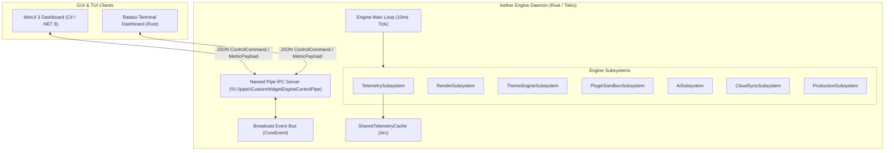

# Aether — Project Overview

**Next-Gen Windows Desktop Customization Platform**
*Target OS: Windows 11 (x86_64 & ARM64)*

---

## 1. Vision & Executive Summary

Aether is a modular, high-performance desktop widget engine and customization platform designed specifically for modern Windows 11 operating systems. Combining a low-latency **Rust engine backend daemon** with a rich **WinUI 3 (C#) management dashboard** and a **Ratatui terminal interface (TUI)**, Aether enables responsive desktop customization, system telemetry monitoring, and extensible widget plugin development.

The platform architecture follows the **"Collect Once, Publish Everywhere"** paradigm: hardware telemetry (CPU, RAM, GPU, Network) is sampled by a central engine daemon once per 10 ms cycle and made accessible via lock-free shared memory caches and low-overhead Named Pipe IPC channels.

---

## 2. Technical Stack Breakdown

| Subsystem | Technologies | Purpose |
|---|---|---|
| **Engine Core Backend** | Rust 2021 Edition, Tokio 1.38 (`full` async runtime), `tracing` | High-frequency 10ms tick daemon, IPC pipe server, subsystem orchestration |
| **System Providers** | Rust, Win32 API (`GetSystemTimes`, `GlobalMemoryStatusEx`) | Telemetry collection and `SharedTelemetryCache` management |
| **Widget SDK & Runtime** | Rust, `mlua` (Lua 5.4), `taffy` (Flexbox engine) | Widget lifecycle traits, batch canvas renderer, plugin runtime sandbox |
| **GUI Dashboard** | C# (.NET 8.0), WinUI 3, Windows App SDK 2.2 | Desktop app shell, Mica backdrops, telemetry poller, widget controls |
| **Terminal Dashboard** | Rust, `ratatui 0.28`, `crossterm 0.28` | CLI status monitor, real-time animated gauges over IPC |
| **Native Hooks** | C++17, Win32 API (`Progman` / `WorkerW` message injection) | Desktop shell window hooking (`SHELLDLL_DefView`) |

---

## 3. Architecture Blueprint



---

## 4. Repository Structure & Workspace Crates

The codebase comprises **17 Rust workspace crates**, a **C# WinUI 3 Dashboard project**, and **C++ Native Hooks**:

```
Aether-custom-widget/
├── Cargo.toml                      # Workspace manifest (17 crate members)
├── launch.ps1                      # Powershell multi-window launch script
├── crates/
│   ├── ai_engine/                  # Synthetic layout, theme, and widget generation
│   ├── animation_engine/           # Easing curves and spring physics
│   ├── cloud_sync/                 # CRDT state synchronization & offline queues
│   ├── core_engine/                # Engine daemon, IPC server, tick orchestrator
│   ├── dashboard_tui/              # Ratatui terminal dashboard client
│   ├── installer/                  # Local installer / app setup tool
│   ├── ipc_protocol/               # Shared IPC schemas (ControlCommand, MetricPayload)
│   ├── layout_engine/              # Taffy Flexbox layout solver integration
│   ├── lua_runtime/                # mlua widget scripting integration
│   ├── package_manager/            # Widget installer & signature checker
│   ├── perf_monitor_widget/        # Built-in performance widget plugin
│   ├── plugin_runtime/             # Plugin supervisor & capability checks
│   ├── production_engine/          # Security audits, stress testing, docs portal
│   ├── system_providers/           # CPU, RAM, GPU, Net providers & SharedTelemetryCache
│   ├── theme_engine/               # Theme schema resolver and watcher
│   ├── widget_parser/              # TOML widget manifest parser
│   └── widget_sdk/                 # WidgetLifecycle trait & BatchRenderCanvas
├── native/
│   └── win32_hooks/                # C++ WorkerW desktop window hook
├── src_gui/
│   └── CustomWidget.Dashboard/     # WinUI 3 C# Management App
└── docs/                           # Modular documentation library
```

---

## 5. Current Prototype vs Production Target

| Feature Area | Current Prototype Implementation | Production Target State |
|---|---|---|
| **CPU & RAM Telemetry** | ✅ **Real Win32 API** (`GetSystemTimes`, `GlobalMemoryStatusEx`) | ✅ Native Win32 / PDH counters |
| **GPU & Network Telemetry** | 🔶 **Simulated** (Mathematical sine waves & byte modulos) | NVML / DXGI Engine queries & `GetIfTable2` |
| **IPC Communication** | ✅ **Real Named Pipe** (`\\.\pipe\CustomWidgetEngineControlPipe`) | ✅ Named Pipe with ACL authorization |
| **Desktop Compositing** | 🔶 **In-Memory Frame Stats** (Dirty region calculations) | DirectComposition / Direct2D WorkerW rendering |
| **Plugin Sandboxing** | 🔶 **In-Memory PID Supervisor** | Windows AppContainer & Job Object isolation |
| **WinUI 3 Management GUI** | ✅ **Fully Functional** (6 pages, live metrics, process control) | ✅ Production WinUI 3 release |
| **Ratatui TUI Dashboard** | ✅ **Fully Functional** (Live CPU/RAM gauges over IPC) | ✅ Terminal dashboard |
