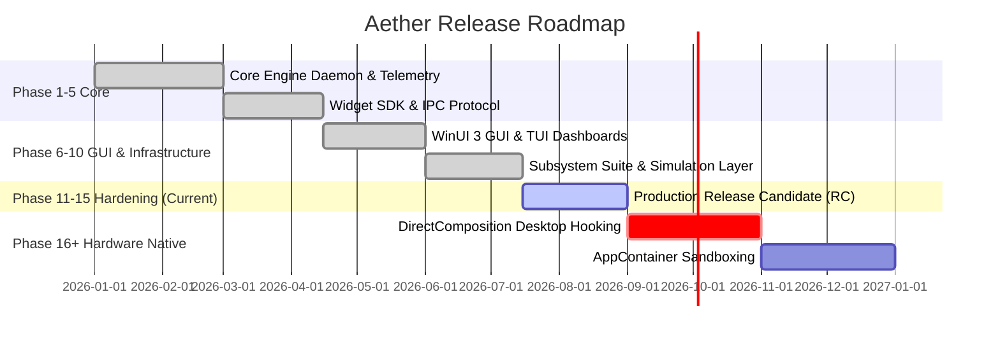

# Aether — Product Roadmap

**Document Status: Active Development Roadmap**

---

## Roadmap Overview

Aether is structured across a multi-phase development timeline transitioning the engine from a high-performance **Proof-of-Concept / Prototype** into a **Production-Ready Desktop Customization Platform**.

---

## Phase Milestones Overview

---

## Near-Term Goals (Q3 2026 — Phase 15 RC Consolidation)

- [x] **Core Async Host**: 10 ms Tokio tick loop orchestrating 10 engine subsystems cleanly.
- [x] **Real-time Telemetry Pipe**: Win32 `GetSystemTimes` (CPU) and `GlobalMemoryStatusEx` (RAM) published to `SharedTelemetryCache`.
- [x] **Named Pipe IPC Server**: Multi-client JSON protocol supporting ping, metrics, widget loading, and subsystem diagnostics.
- [x] **WinUI 3 Dashboard Shell**: Complete C# application shell with Mica backdrops, live gauge visualizers, process management, and diagnostic logging.
- [x] **Ratatui Terminal Dashboard**: TUI client polling IPC pipe with animated gauges.
- [x] **Comprehensive Test Suite**: Maintain 100% test pass rate across all workspace crates (**87/87 tests passing**).

---

## Mid-Term Goals (Q4 2026 — Real Hardware & Compositing)

- [ ] **DirectComposition Desktop Surface Integration**: Connect native `workerw_hook.cpp` C++ layer to Rust `Direct2DRenderer` via FFI to render widgets behind Windows desktop icons.
- [ ] **Hardware DXGI/NVML GPU Telemetry**: Replace GPU sine wave provider with real DXGI performance counter telemetry.
- [ ] **Network Interface Telemetry**: Integrate `GetIfTable2` Win32 API into `NetworkProvider` for real-time bytes sent/received measurement.
- [ ] **AppContainer Sandbox Enforcement**: Transition `PluginSupervisor` from simulated PID state to Windows `CreateAppContainerProfile` and `AssignProcessToJobObject`.
- [ ] **Lua Runtime API Expansion**: Register SDK telemetry, canvas, and event functions within `mlua` environment.

---

## Long-Term Vision (2027+ — Ecosystem & Cloud)

- [ ] **CRDT Cloud Synchronization**: Wire `cloud_sync` manager to production REST/WebSocket backend services for seamless multi-device config sync.
- [ ] **Ed25519 Package Signature Verification**: Integrate `ring` cryptographic crate into `package_manager` for signed widget installation.
- [ ] **Local AI Model Runtime**: Replace keyword prompt matching in `ai_engine` with local ONNX runtime for intelligent layout synthesis.
- [ ] **TypeScript / Web Widget SDK**: Provide WebAssembly / Web-based widget rendering container.
