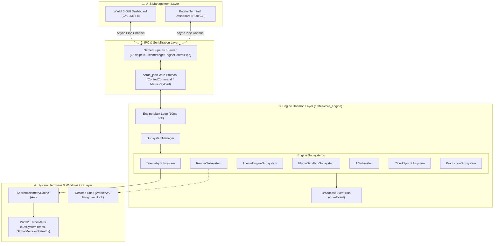
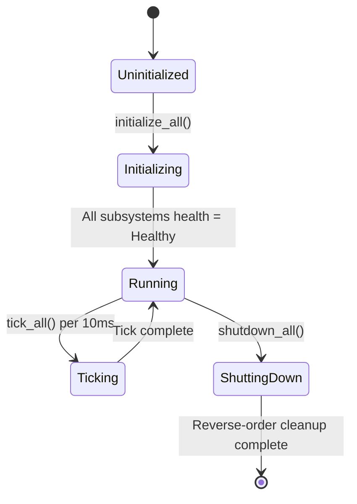

# Aether — Architectural Overview

**High-Level System Architecture and Topology**

---

## 1. System Layers & Topology

Aether is designed as a decoupled, multi-process desktop platform. The system is split across four primary architectural layers:



---

## 2. Core Architectural Principles

### 2.1 "Collect Once, Publish Everywhere"
Hardware metrics are sampled exclusively by `TelemetryService` inside `system_providers` on each 10 ms engine tick cycle. Results are written directly to `SharedTelemetryCache` (`Arc<RwLock<TelemetrySnapshot>>`). Widgets, IPC listeners, and TUI gauges perform zero direct OS calls; they read exclusively from the thread-safe cache, minimizing system overhead.

To match Windows Task Manager accuracy and eliminate erratic metric spikes:
- **Sub-Quantum Tick Holding**: When `GetSystemTimes` reports zero total time delta due to sampling faster than the 15.6ms Windows system timer quantum, the CPU collector holds the last valid measurement rather than using artificial sine wave fallbacks.
- **Exponential Moving Average (EMA) Filtering**: Metric samples undergo Task Manager-style EMA smoothing ($\alpha = 0.25$) across consecutive ticks to prevent high-frequency jitter.
- **Time-Scaled Network Throughput**: Network throughput ($\text{Bytes/sec}$) is scaled by exact elapsed duration ($\Delta t$) between hardware samples.

### 2.2 Interface Isolation & Subsystem Abstraction
Every engine feature module implements the `Subsystem` trait:
```rust
#[async_trait]
pub trait Subsystem: Send + Sync {
    fn name(&self) -> &'static str;
    async fn initialize(&mut self) -> Result<()>;
    async fn tick(&mut self) -> Result<()>;
    async fn shutdown(&mut self) -> Result<()>;
    fn health(&self) -> SubsystemHealth;
}
```
This guarantees that all engine capabilities can be initialized, ticked, monitored, and safely shut down in reverse dependency order without tight coupling.

### 2.3 Out-of-Process Plugin Sandbox Supervision
Plugins execute under AppContainer SID and JobObject resource constraints. The `PluginSupervisor` isolates plugin process crashes from the core daemon runtime, supporting automatic process restart, quarantine after excess crash attempts, clean plugin unloading (`unload_plugin`), and active plugin listing (`list_plugins`).

### 2.4 Decoupled GUI Architecture
The WinUI 3 management app operates in an entirely separate OS process from the Rust engine. Communication is mediated by Windows Named Pipes. If the GUI dashboard crashes or is closed by the user, the core engine daemon continues running and executing widgets uninterrupted.

---

## 3. Subsystem Integration Topology

The `SubsystemManager` maintains the active list of registered subsystems and controls state transitions:



