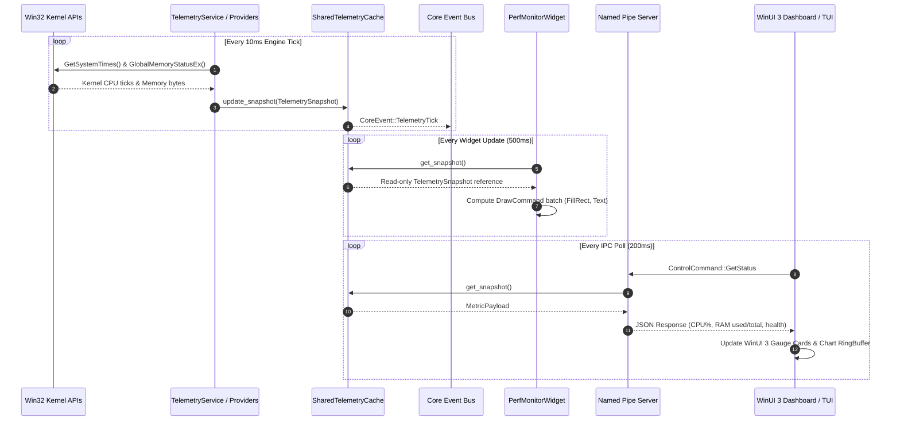
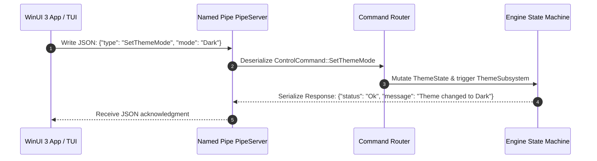

# Aether — Data Flow Architecture

**End-to-End Metric and Command Pipelines**

---

## 1. End-to-End Telemetry Pipeline

Hardware metrics flow through a zero-copy, single-writer pipeline from kernel APIs down to UI dashboard renderers:



---

## 2. Command & Control Pipeline

Control commands flow bi-directionally between IPC clients (WinUI 3 GUI or Ratatui TUI) and the Rust engine daemon:



---

## 3. Data Schema Standards

### 3.1 Telemetry Snapshot Schema (`system_providers::SharedTelemetryCache`)
```rust
pub struct TelemetrySnapshot {
    pub timestamp_ms: u64,
    pub cpu_usage_pct: f32,
    pub gpu_usage_pct: f32,
    pub memory_used_mb: f32,
    pub memory_total_mb: f32,
    pub net_recv_bytes_per_sec: u64,
    pub net_sent_bytes_per_sec: u64,
    pub custom_metrics: HashMap<String, f64>,
}
```

### 3.2 IPC Wire Message Schema (`ipc_protocol::messages`)
```rust
#[derive(Debug, Clone, Serialize, Deserialize)]
#[serde(tag = "type", content = "payload")]
pub enum ControlCommand {
    Ping,
    Pong,
    GetStatus,
    LoadWidget { manifest_path: String },
    UnloadWidget { widget_id: String },
    SetThemeMode { mode: String },
    ReloadAll,
    GetSubsystemHealth,
    GetDiagnostics,
    ToggleDesktopWidget,
    SetWidgetPosition { widget_id: String, x: i32, y: i32 },
    SetWidgetLock { widget_id: String, locked: bool },
    ToggleWidgetLock { widget_id: String },
}
```

