# Aether — Dependency Graph & Workspace Topology

**Internal Crate DAG and External Dependency Blueprint**

---

## 1. Internal Rust Workspace Crate DAG

```mermaid
graph TD
    %% Main Executables
    CoreEngine["core_engine (Daemon)"]
    DashboardTUI["dashboard_tui (Terminal CLI)"]
    Installer["installer (Setup App)"]

    %% Built-in Widget
    PerfWidget["perf_monitor_widget"]

    %% Core Subsystem Crates
    SystemProviders["system_providers"]
    WidgetSDK["widget_sdk"]
    WidgetParser["widget_parser"]
    IPCProtocol["ipc_protocol"]
    PluginRuntime["plugin_runtime"]
    PackageManager["package_manager"]
    CloudSync["cloud_sync"]
    ThemeEngine["theme_engine"]
    AnimationEngine["animation_engine"]
    LayoutEngine["layout_engine"]
    LuaRuntime["lua_runtime"]
    AIEngine["ai_engine"]
    ProductionEngine["production_engine"]

    %% Core Engine Connections
    CoreEngine --> IPCProtocol
    CoreEngine --> SystemProviders
    CoreEngine --> WidgetSDK
    CoreEngine --> WidgetParser
    CoreEngine --> PluginRuntime
    CoreEngine --> PackageManager
    CoreEngine --> CloudSync
    CoreEngine --> ThemeEngine
    CoreEngine --> AnimationEngine
    CoreEngine --> LayoutEngine
    CoreEngine --> LuaRuntime
    CoreEngine --> AIEngine
    CoreEngine --> ProductionEngine
    CoreEngine --> PerfWidget

    %% Client Connections
    DashboardTUI --> IPCProtocol
    PerfWidget --> WidgetSDK
    PerfWidget --> SystemProviders
    PackageManager --> WidgetParser
    PluginRuntime --> IPCProtocol
```

---

## 2. Key External Dependencies Summary

### Rust Workspace (`Cargo.toml`)
- `tokio 1.38`: Multi-threaded async runtime with `full` features.
- `serde 1.0` & `serde_json 1.0`: Wire message serialization.
- `windows 0.58`: Native Win32 API bindings (`GetSystemTimes`, `GlobalMemoryStatusEx`).
- `ratatui 0.28` & `crossterm 0.28`: Terminal UI gauges and event loop.
- `tracing 0.1` & `tracing-subscriber 0.3`: Structured diagnostics.
- `mlua 0.9`: Lua 5.4 scripting bridge.
- `taffy 0.5`: Flexbox layout computation engine.
- `anyhow 1.0` & `thiserror 1.0`: Error propagation.

### C# GUI Dashboard (`CustomWidget.Dashboard.csproj`)
- `Microsoft.WindowsAppSDK 1.5/2.2`: WinUI 3 controls, Mica backdrop, Windows App Runtime.
- `CommunityToolkit.Mvvm`: `[ObservableProperty]` and `[RelayCommand]` code generation.
- `Microsoft.Extensions.DependencyInjection`: Service registration and resolution.
