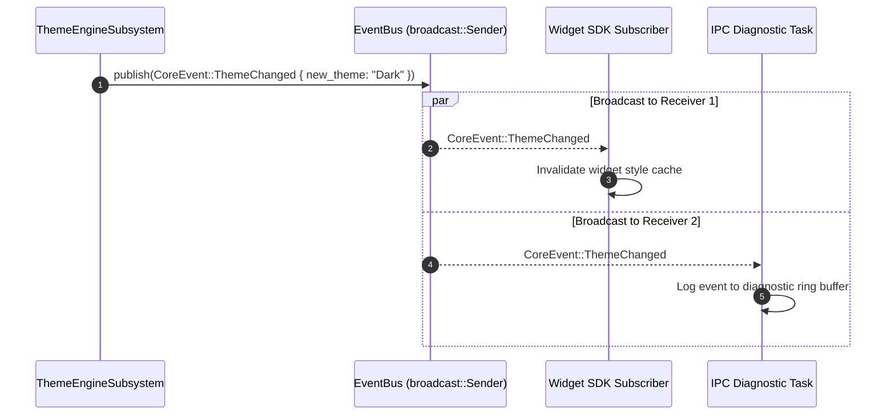

# Aether — Event System Architecture

**Core Event Bus, Channels, and Topic Subscriptions**

---

## 1. Core Event Bus

Aether implements an asynchronous, topic-free central event bus using `tokio::sync::broadcast`. The event bus is encapsulated within `core_engine::event_bus::EventBus`.

```rust
pub struct EventBus {
    sender: broadcast::Sender<CoreEvent>,
}
```

The default capacity is configured to **1024 messages** via `EngineConfig::with_event_channel_capacity()`.

---

## 2. Typed Event Taxonomy (`CoreEvent`)

All events propagated through the engine core belong to the `CoreEvent` enum:

```rust
#[derive(Debug, Clone, PartialEq, Serialize, Deserialize)]
pub enum CoreEvent {
    /// Fired on every 10ms engine tick
    TelemetryTick { timestamp_ms: u64, cpu_pct: f32, ram_mb: f32 },
    /// Fired when theme mode changes
    ThemeChanged { new_theme: String },
    /// Fired when a widget is mounted
    WidgetLoaded { widget_id: String },
    /// Fired when a widget is unmounted
    WidgetUnloaded { widget_id: String },
    /// Fired when engine state transitions (e.g. Paused, Running, Stopped)
    SystemStateChanged { old_state: String, new_state: String },
    /// Fired on subsystem health updates
    SubsystemHealthChanged { name: String, healthy: bool },
}
```

---

## 3. Subscription & Dispatch Lifecycle



---

## 4. Widget Event Subscriptions (`widget_sdk::events`)

Widgets subscribe to specific topic channels using the `EventSubscriber` primitive in `widget_sdk`:

```rust
let mut subscriber = EventSubscriber::new();
subscriber.subscribe("telemetry.tick");
subscriber.subscribe("theme.change");

// In widget tick update loop:
while let Some(event) = subscriber.poll_next() {
    match event.topic.as_str() {
        "theme.change" => widget.reload_colors(),
        _ => {}
    }
}
```
