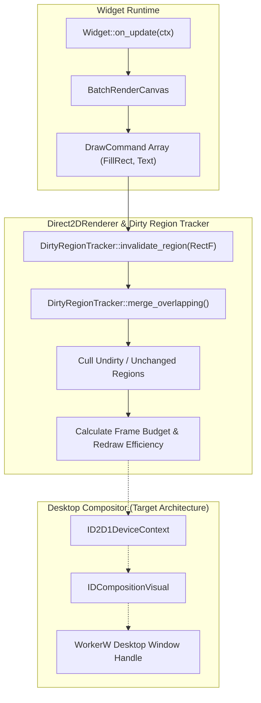

# Aether — Rendering Pipeline & Compositing Architecture

**Dirty Region Math, DrawCommand Batching, and Window Hooking**

---

## 1. Compositing Pipeline Overview

The rendering subsystem (`crates/core_engine/src/rendering/`) manages surface invalidation, dirty region calculation, and batch command generation:



---

## 2. Geometry & Dirty Region Tracking (`DirtyRegionTracker`)

The `DirtyRegionTracker` tracks bounding boxes (`RectF`) requiring redraw across frames:

```rust
pub struct DirtyRegionTracker {
    regions: Vec<RectF>,
}
```

Key operations verified by unit tests:
- **`invalidate_region(rect)`**: Adds bounding box to current frame dirty queue.
- **`merge_overlapping()`**: Computes unions of intersecting boxes to minimize draw call overhead.
- **`zero_redraw_skip`**: If zero regions are dirty, frame composition is skipped entirely, conserving CPU/GPU power.

---

## 3. Draw Command Primitives (`widget_sdk::rendering`)

Widgets emit resolution-independent draw primitives rather than direct DirectX calls:

```rust
#[derive(Debug, Clone, PartialEq)]
pub enum DrawCommand {
    FillRect {
        rect: RectF,
        color: Color,
        corner_radius: f32,
    },
    Text {
        text: String,
        font: String,
        size: f32,
        rect: RectF,
        color: Color,
    },
}
```

---

## 4. Native Desktop Window Hooking (`native/win32_hooks/src/workerw_hook.cpp`)

Aether injects widget visual surfaces directly behind Windows desktop icons using the standard Progman `0x052C` message technique:

1. Send `0x052C` message to `Progman` top-level window.
2. Enumerate windows to locate the spawned `WorkerW` window holding `SHELLDLL_DefView`.
3. Retrieve `WorkerW` `HWND` to serve as the parent DirectComposition target visual handle.

> [!NOTE]
> The WorkerW C++ hook (`workerw_hook.cpp`) is complete as a standalone native library. Future FFI integration will bind this HWND directly to `Direct2DRenderer`.
