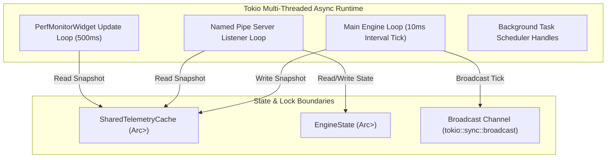

# Aether — Threading & Async Execution Model

**Concurrency Model, Channels, and Lock Management**

---

## 1. Async Runtime Architecture

Aether relies on **Tokio 1.38 (`features = ["full"]`)** for multi-threaded asynchronous task scheduling. The execution model is structured around a centralized host daemon process running worker threads mapped to available CPU logical cores.



---

## 2. Main Engine Tick Loop Cadence

The engine execution driver operates inside `core_engine::Engine::start()`:

```rust
let tick_interval = self.config.tick_interval_ms; // 10 ms
let mut interval = tokio::time::interval(Duration::from_millis(tick_interval));

while *self.state.read().await == EngineState::Running {
    interval.tick().await;
    self.tick().await?;
}
```

During each 10 ms interval tick:
1. `TelemetrySubsystem` samples hardware providers and writes to `SharedTelemetryCache`.
2. `SubsystemManager` invokes `tick()` on all registered subsystems sequentially.
3. `EventBus` broadcasts `CoreEvent::TelemetryTick`.
4. Any active widget background tasks receive notification and schedule re-renders.

---

## 3. Communication Channels & Topologies

| Channel Type | Primitive | Sender | Receiver | Purpose |
|---|---|---|---|---|
| **Event Bus** | `tokio::sync::broadcast` | `EventBus` | Subsystems, Widgets | Pub/Sub system-wide events (`CoreEvent`). Capacity: 1024. |
| **IPC Pipe** | `tokio::net::windows::named_pipe` | C# GUI / TUI Client | `IpcServer` task | Request/Response control commands (`ControlCommand`). |
| **Task Handles** | `tokio::task::JoinHandle` | `TaskScheduler` | Engine Manager | Delayed & periodic background task management. |

---

## 4. Lock Safety & Non-Blocking Rules

To guarantee predictable latency in the 10 ms tick loop, the following rules are strictly enforced:

1. **Zero Blocking Calls on Async Workers**: No standard library `std::thread::sleep` or blocking I/O inside Tokio tasks.
2. **Lock Hold Duration**: `RwLock` read/write guards on `SharedTelemetryCache` and `EngineState` must be held for minimal duration (scope-bounded clones).
3. **Write Priority**: Telemetry writers clone snapshots before holding the write lock to prevent reader starvation.
