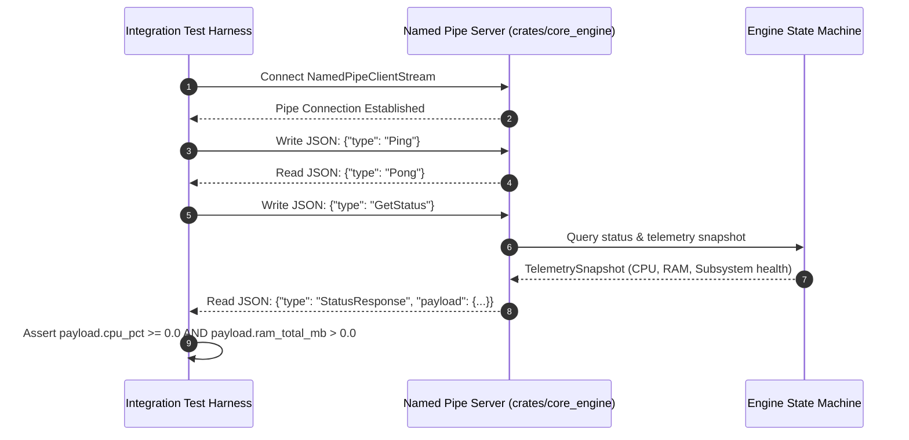

# Aether — Integration Testing Architecture

**IPC Client/Server End-to-End Integration Validation**

---

## 1. IPC Integration Testing Harness

Integration testing validates the bi-directional communication flow between client applications (WinUI 3 GUI and Ratatui TUI) and the Named Pipe IPC server:

---

## 2. Integration Test Scenarios

| Scenario ID | Test Objectives | Verified Assertions |
|---|---|---|
| **INT-IPC-01** | Named Pipe Connection & Ping | Server responds with `Pong` within 10 ms. |
| **INT-IPC-02** | Live Telemetry Streaming | `GetStatus` returns non-zero total RAM and active subsystem status list. |
| **INT-IPC-03** | Multi-Client Pipe Concurrent Access | Concurrent connections from WinUI GUI and Ratatui TUI proceed without pipe lock contention. |
| **INT-IPC-04** | Theme Swapped Signal Propagation | `SetThemeMode` command updates engine state and publishes `CoreEvent::ThemeChanged` to event bus. |
| **INT-SUB-01** | Engine Graceful Shutdown | Requesting `stop()` triggers reverse-order subsystem shutdown cleanly within timeout budget. |
