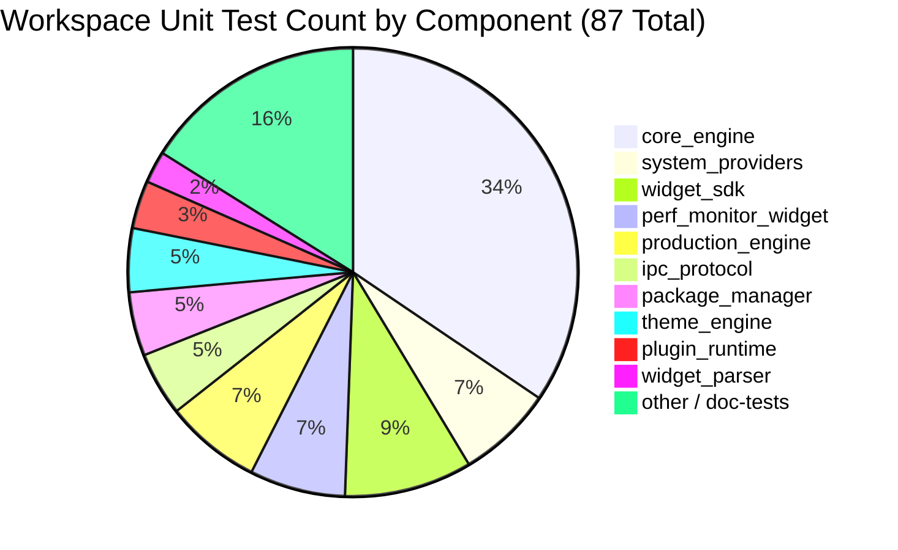

# Aether — Testing Architecture & Protocol

**Verification Architecture, Governance Rules, and Test Suite Summary**

---

## 1. Governance Rule: Mandatory Test Enforcement

Per project governance rules:

> **Mandatory Rule**: Regardless of the size or nature of a request, every code change MUST include tests that pass before a task is complete. `cargo test --workspace` must exit with code 0 with zero failing tests.

---

## 2. Test Suite Status Summary

```
Total Workspace Unit Tests: 87 / 87 Passing (100% Pass Rate)
Test Execution Command: cargo test --workspace
Compilation Verification: cargo check --workspace
```



---

## 3. Test Categories & Scope

| Test Level | Scope | Execution Target | Responsible Framework |
|---|---|---|---|
| **Unit Tests** | Function, method, struct state machine validation | `cargo test --workspace` | Built-in `#[test]` Rust test runner |
| **Doc Tests** | Public API code example validity | `cargo test --doc` | Rustdoc runner |
| **Integration Tests** | IPC named pipe roundtrip & subsystem lifecycle | `crates/core_engine/src/ipc_server.rs` | Async Tokio test runner (`#[tokio::test]`) |
| **Micro-Benchmarks** | dirty region tracking, telemetry collect latency | `RainmeterBenchmark` | Benchmark modules within `core_engine` & `widget_sdk` |
