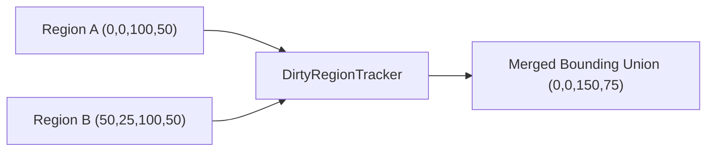

# Aether — GPU Rendering & Dirty Rect Culling Math

**Render Culling Efficiency and Frame Budget Analysis**

---

## 1. Dirty Region Culling Math

To maximize battery life and minimize GPU utilization, `DirtyRegionTracker` calculates minimal redraw bounding boxes:

Let $R_i = (x_i, y_i, w_i, h_i)$ represent invalidated widget regions.
Overlapping rectangles $R_a \cap R_b \neq \emptyset$ are merged into their minimal bounding union:

$$R_{\text{union}} = (\min(x_a, x_b), \min(y_a, y_b), \max(x_a + w_a, x_b + w_b), \max(y_a + h_a, y_b + h_b))$$

---

## 2. Frame Time Budget

For a 60 FPS target rate:

$$\text{Frame Budget} = \frac{1000\text{ ms}}{60} = 16.66\text{ ms}$$

If dirty rect calculation + draw command batching takes $< 0.1\text{ ms}$, over **99% of the frame budget** remains available for GPU DirectX compositing.
