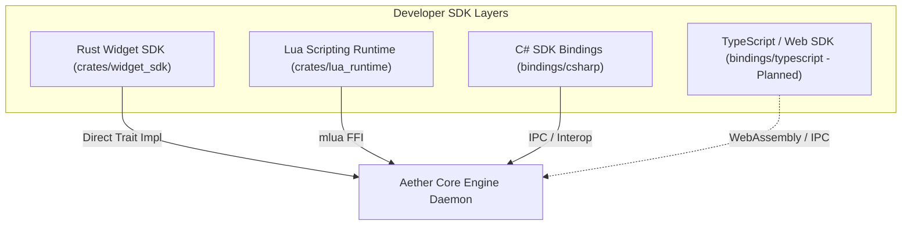

# Aether — Software Development Kit (SDK) Overview

**Developer SDK Architecture and Multi-Language Surface**

---

## 1. Multi-Language SDK Ecosystem

Aether supports multi-language widget development across several language bindings:



---

## 2. API Version Compatibility Matrix

API compatibility is enforced at runtime using `CompatibilityChecker` (`crates/plugin_runtime/src/compatibility.rs`):

```rust
pub const HOST_API_VERSION: &str = "1.0.0";
```

Plugins declaring manifest `api_version = "1.x.y"` are accepted. Plugins requiring a higher major API version are cleanly rejected during `on_load()`.
