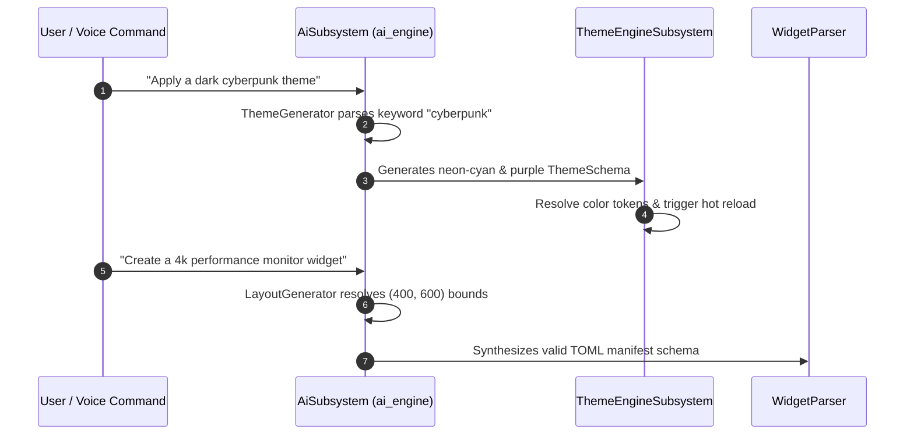

# Aether — AI Engine Vision & Architecture

**Synthetic Layout, Theme, and Widget Generation**

---

## 1. AI Subsystem Architecture (`crates/ai_engine`)

The `ai_engine` crate provides artificial intelligence helpers for synthesizing desktop layouts, color palettes, widget manifest schemas, and voice commands:

```
ai_engine
├── LayoutGenerator       # Calculates (width, height) bounds from prompt text
├── ThemeGenerator        # Generates ThemeSchema from color keywords
├── WidgetGenerator       # Interpolates TOML manifest strings
├── VoiceCommandProcessor # Parses natural language command strings
└── WorkflowAutomation    # Schedules automated tasks
```

---

## 2. Dynamic Synthesis Lifecycle


