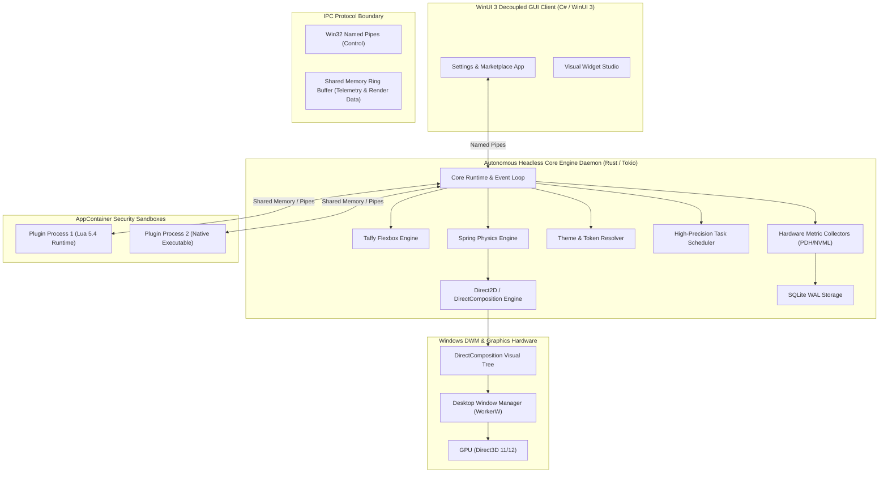

# Master Architecture Specification

## Executive Overview

The **Next-Generation Windows Desktop Customization Platform** is an enterprise-class, hardware-accelerated Windows desktop customization engine designed as a production-grade successor to Rainmeter. The system achieves sub-millisecond frame rendering latency, zero-trust hardware isolation for 3rd-party plugins, dynamic light/dark theme token resolution, multi-language widget SDKs, and an offline-first cloud synchronization model.

---

## High-Level System Architecture



---

## Core System Layers

### 1. Headless Core Daemon (`crates/core_engine`)
- **Technology**: Rust 2021 Edition, Tokio Asynchronous Runtime, `windows-rs` API bindings.
- **Role**: Headless precursor service running continuously in the background decoupled from management UI windows. Operates the event loop (`WM_DISPLAYCHANGE`, `WM_DPICHANGED`, `WM_SETTINGCHANGE`), task scheduler, and subsystem coordinator.

### 2. Rendering Engine (`crates/core_engine/src/rendering`)
- **Technology**: Direct2D 1.1, DirectWrite, DirectComposition.
- **Target**: Renders transparent vector graphics and typography directly onto Windows DWM compositor surfaces (`WorkerW`) beneath desktop icons.
- **Optimization**: Dirty rectangle partial invalidation (`PushAxisAlignedClip`) ensuring zero unnecessary redraws when screen contents are static.

### 3. Data Engine & Telemetry (`crates/system_providers`)
- **Paradigm**: **"Collect Once, Publish Everywhere"**.
- **Role**: Single collector thread samples CPU, RAM, GPU, Network, Disk sensors once per sampling tick and commits to `SharedTelemetryCache`. Widgets and plugins read exclusively from shared memory or event streams—never querying Windows kernel APIs directly.

### 4. Sandbox Runtime (`crates/plugin_runtime`)
- **Security**: Windows `AppContainer` low-integrity SIDs and `JobObject` resource caps (max 2% CPU per plugin, 50 MB RAM cap, child process mitigation).
- **Fault Tolerance**: Out-of-process execution guarantees plugin crashes (segfaults, access violations, memory leaks) never crash the core engine daemon.

### 5. Multi-Language Widget SDK (`crates/widget_sdk`)
- **Languages**: Native Rust (`crates/widget_sdk`), C# .NET 8 (`bindings/csharp/CustomWidget.SDK`), and TypeScript (`bindings/typescript/custom-widget-sdk`).
- **6 API Pillars**: Lifecycle, Rendering, Settings, Events, Animations, Resources.

### 6. Theme Engine (`crates/theme_engine`)
- **Schema**: Declarative `theme.json` configuration driving colors, fonts, icons, widgets, layouts, and spring animations.
- **Hot Reload**: Atomic memory hot-swapping without terminating sandboxed plugins or restarting host processes.

### 7. Marketplace & Package Manager (`crates/package_manager`)
- **CLI**: npm-style package manager supporting `install weather-widget`, `install spotify-widget`, `install taskbar-plus`.
- **Security**: Ed25519 cryptographic signature verification on all `.cwp` package archives.

### 8. Cloud Sync Engine (`crates/cloud_sync`)
- **Coverage**: Synchronizes Layouts, Themes, Settings, Plugins, Devices, Accounts.
- **Resolution**: State-based CRDTs with Lamport Vector Clocks for deterministic multi-device conflict resolution.
- **Offline First**: SQLite WAL local storage with background transaction log queuing (`OfflineSyncQueue`) and AES-256-GCM client encryption.

### 9. AI Intelligence Subsystem (`crates/ai_engine`)
- **Capabilities**: Desktop Automation, Voice Intent Processing (`VoiceIntentParser`), AI Layout Synthesis, AI Theme Generation, AI Widget Synthesis, and Trigger-Condition-Action Workflow Automation.

### 10. Production Engine (`crates/production_engine`)
- **Pillars**: AppContainer security auditing, 100-widget stress testing (<25 MB RAM limit), MSIX delta auto-updating, zero-PII crash minidumps, and release verification.

---

## Master Workspace Directory Hierarchy

```
Cutom-widget/
├── Cargo.toml                    # Master Workspace Configuration
├── README.md                     # Platform Overview
├── docs/                         # mdBook & Architecture Documentation
│   ├── ARCHITECTURE.md           # Master Architecture Specification
│   ├── WIDGET_SDK_GUIDE.md       # Multi-Language Widget SDK Manual
│   ├── THEMING_SPECIFICATION.md  # theme.json Schema & Token Reference
│   ├── SECURITY_AND_SANDBOXING.md# AppContainer & Security Spec
│   ├── MARKETPLACE_CLI.md        # Package Manager & CLI Reference
│   ├── PERFORMANCE_AND_BENCHMARKS.md# Profiler & Rainmeter Comparisons
│   ├── CLOUD_SYNC_SPEC.md        # Encrypted Cloud Sync & CRDT Spec
│   └── AI_SUBSYSTEM.md           # AI Subsystem & Workflow Spec
├── crates/
│   ├── core_engine/              # Primary Headless Daemon (Rust)
│   ├── plugin_runtime/           # AppContainer Sandbox & Process Manager
│   ├── lua_runtime/              # Embedded Lua 5.4 Host Bindings
│   ├── ipc_protocol/             # Shared Memory & Named Pipe Ring Buffers
│   ├── layout_engine/            # Taffy Layout Integrator
│   ├── theme_engine/             # Color Palette & Token Resolver
│   ├── animation_engine/         # Spring Physics & Easing Curves
│   ├── system_providers/         # PDH / NVML Hardware Metric Collectors
│   ├── widget_parser/            # TOML Schema & Expression Evaluator
│   ├── widget_sdk/               # Multi-Language Master Widget SDK
│   ├── package_manager/          # npm-like Package Manager CLI & Security
│   ├── cloud_sync/               # CRDT Encrypted Cloud Sync & Offline Queue
│   ├── ai_engine/                # Voice, Generation & Workflow Engine
│   └── production_engine/       # Security Audit, Stress Testing & Release Suite
├── bindings/
│   ├── csharp/CustomWidget.SDK/  # C# .NET 8 / WinUI 3 SDK Assembly
│   └── typescript/custom-widget-sdk/ # TypeScript @types Definitions Package
├── src_gui/                      # WinUI 3 Management Dashboard (C# / WinUI 3)
└── native/win32_hooks/           # Native C++ DLL for Win32 Shell Hooks
```
