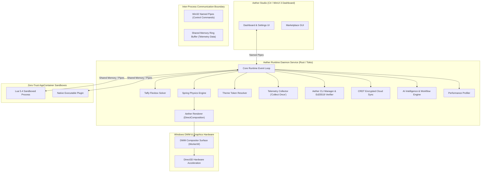

# Aether Architecture — Core Platform Blueprint

## Overview

The **Aether Platform** is a multi-tier, hardware-accelerated desktop customization engine built on Rust (`windows-rs`, `tokio`). It is designed around modularity, low memory utilization, zero-trust security, and reactive high-refresh rendering.

---

## Core System Ecosystem

- **Aether Runtime**: Headless core service daemon managing subsystem lifecycles and event dispatching.
- **Aether Renderer**: DirectComposition / Direct2D 2D GPU compositing pipeline rendering directly onto Windows DWM `WorkerW` surfaces.
- **Aether SDK**: Multi-language developer SDK supporting Rust, C# .NET 8, and TypeScript.
- **Aether CLI**: npm-style package manager CLI with Ed25519 signature verification.
- **Aether Studio**: WinUI 3 management dashboard.

---

## Subsystem Architecture Topology

---

## Further Reading
- [Rendering Pipeline](file:///Users/tanmay/Documents/Github/Cutom-widget-Aether/docs/Rendering.md)
- [Security & Sandboxing](file:///Users/tanmay/Documents/Github/Cutom-widget-Aether/docs/Security.md)
- [Multi-Language Plugin SDK](file:///Users/tanmay/Documents/Github/Cutom-widget-Aether/docs/PluginSDK.md)
- [IPC Specification](file:///Users/tanmay/Documents/Github/Cutom-widget-Aether/docs/IPC.md)
- [Benchmarking Methodology](file:///Users/tanmay/Documents/Github/Cutom-widget-Aether/docs/Benchmarking.md)
