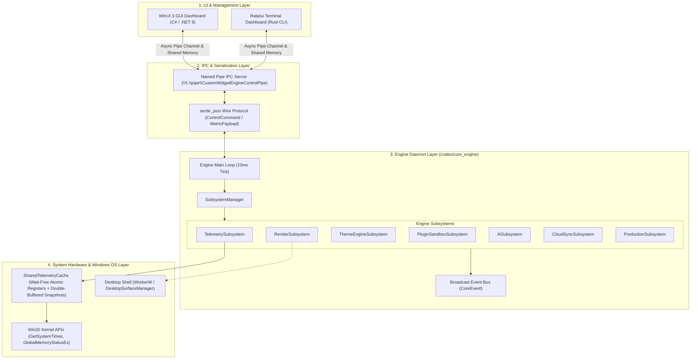
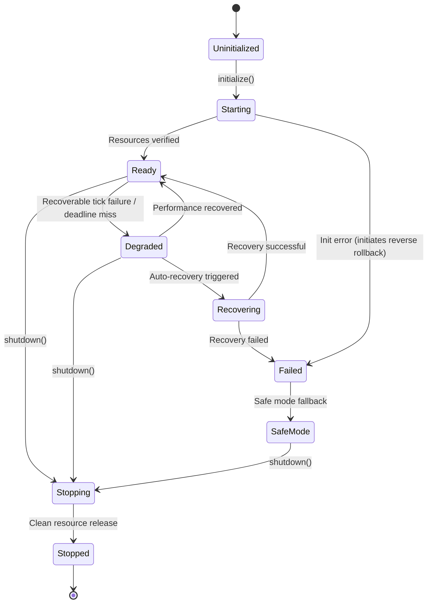
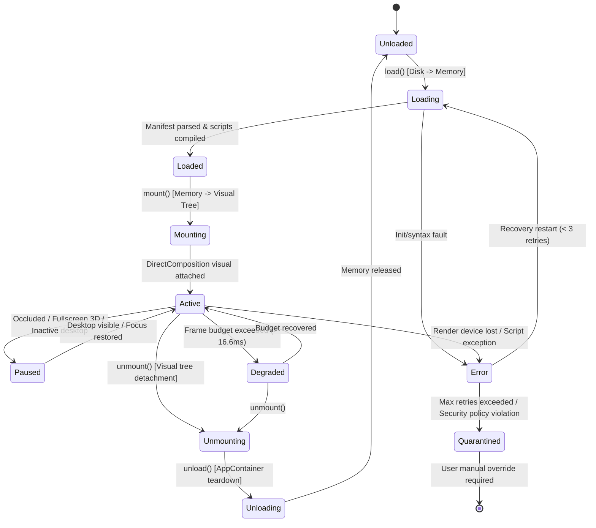

# Aether — Architectural Overview

**High-Level System Architecture and Topology**

---

## 1. System Layers & Topology

Aether is designed as a decoupled, multi-process desktop platform. The system is split across four primary architectural layers:



---

## 2. Core Architectural Principles

### 2.1 "Collect Once, Publish Everywhere"
Hardware metrics are sampled exclusively by `TelemetryService` inside `system_providers` on each 10 ms engine tick cycle. Results are written directly to `SharedTelemetryCache`:
- **Wait-Free Fast Path**: Individual scalar metrics (`cpu_pct_bits`, `gpu_pct_bits`, `memory_used_mb_bits`, `net_recv_bytes_per_sec`, etc.) are stored in 32-bit and 64-bit atomic registers. Readers executing `get_cpu_pct()` or `get_memory_used_mb()` execute in bounded instructions with zero lock contention.
- **Tear-Free Double-Buffered Snapshots**: Composite snapshots (`TelemetrySnapshot`) use an atomic monotonic sequence number (seqlock protocol) with double-buffering, eliminating reader locks and deadlocks.
- **Sub-Quantum Tick Holding**: When `GetSystemTimes` reports zero total time delta due to sampling faster than the 15.6ms Windows system timer quantum, the CPU collector holds the last valid measurement.
- **Exponential Moving Average (EMA) Smoothing**: Metric samples undergo EMA smoothing ($\alpha = 0.25$) across consecutive ticks to prevent high-frequency jitter.
- **Time-Scaled Network Throughput**: Network throughput ($\text{Bytes/sec}$) is scaled by exact elapsed duration ($\Delta t$) between hardware samples.

### 2.2 Interface Isolation & Cadence-Scheduled Subsystems
Every engine feature module implements the `Subsystem` trait with categorized execution cadences:
```rust
#[async_trait]
pub trait Subsystem: Send + Sync {
    fn name(&self) -> &'static str;
    async fn initialize(&mut self, event_bus: Arc<EventBus>) -> anyhow::Result<()>;
    async fn tick(&mut self) -> anyhow::Result<()>;
    async fn shutdown(&mut self) -> anyhow::Result<()>;
    fn health(&self) -> SubsystemHealth;
    fn scheduling_cadence(&self) -> SchedulingCadence {
        SchedulingCadence::Periodic { interval_ms: 10 }
    }
}
```
If any subsystem fails during `SubsystemManager::initialize_all()`, a failure-aware reverse cleanup rollback (`on_unload`) automatically tears down all previously initialized subsystems to prevent orphan resources and leaks.

### 2.3 Out-of-Process Plugin Sandbox Supervision
Plugins execute under AppContainer SID and JobObject resource constraints. The `PluginSupervisor` isolates plugin process crashes from the core daemon runtime, supporting automatic process restart, quarantine after excess crash attempts, clean plugin unloading (`unload_plugin`), and active plugin listing (`list_plugins`).

### 2.4 Authoritative DirectComposition & Desktop Shell Recovery
The primary rendering pipeline utilizes DirectComposition visual trees bound to Direct2D / Direct3D 11 device contexts behind desktop icons (`WorkerW`). Layered HWND (`UpdateLayeredWindow`) is strictly isolated as a compatibility fallback. The `DesktopSurfaceManager` monitors Explorer.exe process lifecycle and automatically rebinds WorkerW surfaces upon shell restarts.

### 2.5 Decoupled Multi-Reader Shared-Memory IPC
High-throughput telemetry is distributed to multiple readers (WinUI 3 GUI dashboard, ratatui TUI, widget runtimes) via SPMC seqlock snapshot buffers (`MultiReaderSnapshotBuffer`) and independent cursor ring buffers (`MultiReaderRingBuffer`), preventing reader contention and pointer corruption.

---

## 3. Lifecycle State Machines: Subsystems (9 States) vs Widgets (11 States)

To eliminate architectural conflation, Aether strictly bifurcates daemon subsystem orchestration from desktop widget plugin supervision.

### 3.1 Core Subsystem Lifecycle State Machine (9 States)

Core engine host daemons (`telemetry`, `gpu_render_engine`, `theme_engine`, `plugin_sandbox`, etc.) execute under the control of `SubsystemManager` across 9 formal states:



1. **`Uninitialized`**: Registered in manager, awaiting event bus binding.
2. **`Starting`**: Async initialization in progress.
3. **`Ready`**: Healthy and executing on declared cadence (`Periodic`, `Reactive`, `OnDemand`, `DeadlineDriven`).
4. **`Degraded`**: Operating with transient faults or missed deadlines; telemetry alerts logged.
5. **`Recovering`**: Auto-remediation attempt in progress (e.g. device reset).
6. **`Stopping`**: Graceful shutdown in progress.
7. **`Stopped`**: Resources released in reverse registration order; zero leaks.
8. **`Failed`**: Fatal failure; excluded from scheduler ticks.
9. **`SafeMode`**: Minimal operational state with high-risk features disabled.

---

### 3.2 Widget Plugin Lifecycle State Machine (11 States)

Desktop widgets operate inside sandboxed AppContainer boundaries across 11 distinct operational states:



#### Architectural Justification for All 11 Widget States

Why are all 11 states strictly necessary? Each state serves an irreplaceable role in resource management, OS compositing, and sandboxing:

1. **`Unloaded` vs `Loaded`**: Separates dormant disk-only plugins from pre-warmed widgets held in host memory. Pre-warmed widgets can mount instantly (< 2ms) upon virtual desktop switching without disk I/O.
2. **`Loading` vs `Mounting`**: `Loading` is non-visual, asynchronous memory allocation, manifest schema validation, and Lua script compilation. `Mounting` is the thread-affine Win32 and DirectComposition desktop visual tree attachment behind `WorkerW`. Conflating them causes UI thread stalls during script parsing.
3. **`Active` vs `Paused` vs `Degraded`**:
   - **`Active`**: Normal operation; emitting `DrawCommand` batches at the display refresh rate.
   - **`Paused`**: Widget is occluded behind full-screen windows or on an inactive virtual desktop. Ticking is completely suspended (0 Hz), saving CPU and battery, but GPU surfaces are retained for instantaneous unpausing.
   - **`Degraded`**: Widget is still visible and ticking, but has exceeded its frame budget (> 16.6ms). It automatically sheds costly effects (disables Gaussian blur/acrylic) or drops to half-rate to prevent desktop compositor judder.
4. **`Unmounting` vs `Unloading`**: `Unmounting` detaches the visual node from the DirectComposition visual tree without destroying memory; `Unloading` releases D2D bitmaps, closes shared memory handles, and terminates the AppContainer worker process.
5. **`Error` vs `Quarantined`**:
   - **`Error`**: Transient failures (e.g. GPU device loss, network timeout, single unhandled Lua exception). Eligible for automatic exponential-backoff restarts.
   - **`Quarantined`**: Permanent isolation triggered by crash loops (> 3 crashes in 60s) or security sandbox policy violations (e.g. unauthorized disk access attempt, path traversal evasion). Quarantined widgets are forbidden from auto-restarting to protect system stability and require explicit user intervention.

