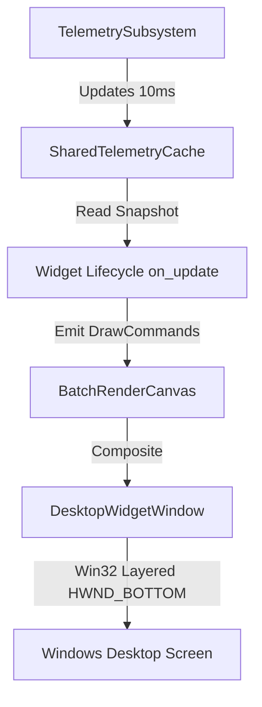

# Core Desktop Rendering & Widget Config Architecture

## Overview
Aether core engine provides desktop-only, hardware-accelerated transparent rendering via DirectComposition and Direct2D. Widgets emit abstract `DrawCommand` batches during each 10 ms cycle without performing direct OS API rendering or operating as standalone floating windows.

## Core Rendering Pipeline

## Key Components

### 1. `DesktopWidgetWindow` (`core_engine/src/rendering/desktop_widget_window.rs`)
- Manages the native transparent desktop overlay window (`WS_EX_LAYERED`, `WS_EX_TOOLWINDOW`, `WS_EX_NOACTIVATE`).
- Positioned directly above the desktop wallpaper (`HWND_BOTTOM` / WorkerW insertion).
- Supports click-through and drag-lock toggles per widget.

### 2. `WidgetConfigStore` (`core_engine/src/widget_config_store.rs`)
- Manages per-widget runtime configurations stored as JSON files under `%LOCALAPPDATA%\Aether\widget_settings\<widget_id>.json`.
- Persists display options:
  - `opacity`: Clamped `[0.0, 1.0]`
  - `scale`: Scale factor (default `1.0`)
  - `locked`: Position drag-lock status
  - `enabled`: Active updating status
  - `quick_swap`: QuickSwap capability flag
- Supports IPC-driven updates (`UpdateWidgetDisplayOptions`, `QuickSwapWidget`, `EnableWidget`, `DisableWidget`, `SetWidgetOpacity`, `ResetWidgetConfig`).

### 3. Dynamic Contrast Protection (`ContrastGuard`)
- `ContrastGuard::ensure_legible_fg(fg, bg)` automatically computes sRGB relative luminance and WCAG 2.1 contrast ratio.
- If contrast ratio falls below `4.5:1` (WCAG AA standard), foreground text/icons are dynamically inverted or adjusted for optimal legibility across varying wallpaper backgrounds.
- `ContrastGuard::select_foreground_color(bg_argb, light, dark)` selects appropriate light or dark palette overrides based on background luminance.

### 4. IPC Messaging (`ipc_protocol/src/messages.rs`)
- `ListWidgets`: Returns rich `WidgetDescriptor` array containing real-time display state and coordinates.
- `UpdateWidgetDisplayOptions`: Modifies display options dynamically.
- `QuickSwapWidget`: Performs position coordinate or configuration swaps between two widgets.
- `EnableWidget` / `DisableWidget`: Manages widget activation state without unloading assembly binaries.

## GUI Dashboard Integration
- C# WinUI 3 `WidgetsPage` provides per-widget settings gear icon buttons with interactive quick-settings flyouts (opacity slider, enable/disable toggle, drag lock toggle, reset button) and detailed settings dialogs.
- `WidgetSettingsService` reads/writes `%LOCALAPPDATA%\Aether\widget_settings\<widget_id>.json` and synchronizes with Core Engine via Named Pipes.
