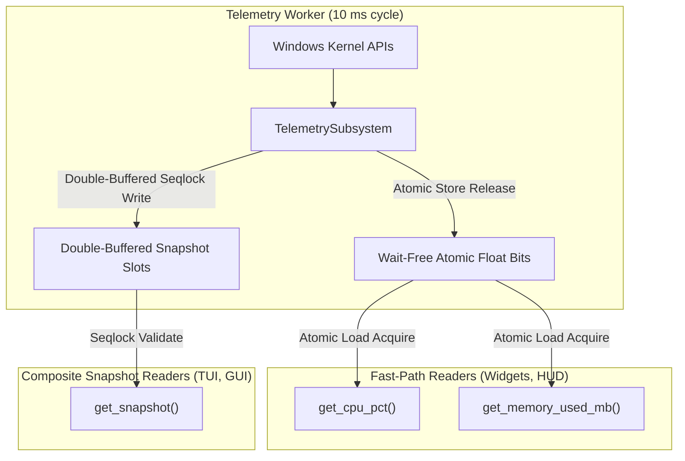

# Memory & Allocation Architecture

**Purpose**: Explains memory allocation models, synchronization primitives, buffer pooling, and LRU resource caching in Aether.  
**Audience**: Performance Engineers, Systems Developers, Security Auditors.  
**Prerequisites**: [Threading_Model.md](Threading_Model.md), [IPC_PROTOCOL.md](IPC_PROTOCOL.md).  
**Related Documents**: [PERFORMANCE_OVERVIEW.md](../Performance/PERFORMANCE_OVERVIEW.md), [ADR.md](ADR.md).  
**Last Updated**: 2026-09-07  
**Status**: Active / Production Technical Specification  
**Owner**: Core Architecture & Performance Team  

---

## 1. Wait-Free Telemetry Publication & Cache Architecture

To guarantee that high-frequency widget render loops (60–144 Hz) never block or stall, `SharedTelemetryCache` completely decouples telemetry writers from readers.



### 1.1 Wait-Free Atomic Scalar Registers
Individual scalars are published using atomic IEEE-754 bitwise transmutation (`f32::to_bits()` / `f32::from_bits()`) into `AtomicU32` and `AtomicU64` registers with `Acquire`/`Release` ordering:
- `cpu_pct_bits: AtomicU32`
- `gpu_pct_bits: AtomicU32`
- `memory_used_mb_bits: AtomicU32`
- `memory_total_mb_bits: AtomicU32`
- `net_recv_bytes_per_sec: AtomicU64`
- `net_sent_bytes_per_sec: AtomicU64`
- `timestamp_ms: AtomicU64`
- `sequence: AtomicU64`

**Formal Concurrency Guarantee**: Readers executing `cache.get_cpu_pct()` or `cache.get_memory_used_mb()` are guaranteed **wait-free** execution. Each load completes in a strictly bounded number of instructions ($O(1)$) with zero retries, zero loops, and complete immunity to writer preemption.

### 1.2 Lock-Free / Seqlock-Style Composite Snapshot Acquisition
Composite `TelemetrySnapshot` structures (including custom metric collections) are published via a sequence-checked double-buffer:
1. Writer increments `sequence` to an odd number (indicating write in progress).
2. Writer populates the inactive buffer slot and updates the active slot pointer.
3. Writer increments `sequence` to an even number (indicating stable commit).
4. Reader loads `sequence` (must be even), copies the slot, and verifies `sequence` matches. If a concurrent write occurred, reader retries with spin loop hints (`spin_loop()`), capped at 16 iterations before yielding.

**Formal Concurrency Guarantee**: `get_snapshot()` is **lock-free**, not wait-free. While it eliminates all reader-reader locking and writer-reader mutexes, a reader can theoretically retry if the writer increments the sequence counter mid-read. System-wide throughput and progress are guaranteed, but individual readers follow bounded retry acquisition.

### 1.3 Hardware Contention & Cache Coherence Reality
Aether's documentation strictly distinguishes between software lock contention and hardware bus contention:
- **Zero Mutex Contention**: No kernel mutexes, semaphores, or critical sections are acquired in the telemetry hot path.
- **Cache Coherence Bus Traffic (MESI/MOESI)**: Zero mutex contention does *not* imply zero hardware contention. When the core daemon writer executes a `Release` store to the sequence counter or payload, hardware cache-coherence protocols broadcast Read-For-Ownership (RFO) and line invalidation cycles across the CPU interconnect. Subsequent `Acquire` loads on reader cores experience L1/L2 cache misses and must reload cache lines from L3/LLC. Telemetry data structures are padded to 64 bytes (`#[repr(align(64))]`) specifically to eliminate false sharing between scalar registers and the sequence counter.

---

## 2. Shared-Memory IPC Layouts (`crates/ipc_protocol`)

Inter-process communication uses 64-byte cacheline-aligned (`#[repr(C, align(64))]`) memory-mapped regions created via Win32 `CreateFileMappingW` and `MapViewOfFile`.

### 2.1 Security Descriptor & Access Control (SDDL)
To prevent unauthorized tampering or escalation from untrusted plugins, all shared-memory sections apply an authoritative Security Descriptor Definition Language (SDDL) string:
```text
D:(A;;FR;;;AC)(A;;FR;;;WD)(A;;FA;;;BA)(A;;FA;;;SY)S:(ML;;NW;;;LW)
```
- `(A;;FR;;;AC)`: AppContainer sandboxed processes are granted **Read-Only** access (`FILE_GENERIC_READ`).
- `(A;;FR;;;WD)`: Everyone (all desktop users) granted Read-Only access.
- `(A;;FA;;;BA)`: Built-in Administrators granted Full Access (`FILE_ALL_ACCESS`).
- `(A;;FA;;;SY)`: Local SYSTEM account granted Full Access.
- `S:(ML;;NW;;;LW)`: Mandatory Integrity Level set to Low Integrity (`No-Write-Up`), allowing AppContainer sandboxed reader processes to open the mapping.

### 2.2 Standard Segment Header (`ShmHeader`)
All shared memory segments begin with an authoritative 64-byte fixed-width header:
```rust
#[repr(C, align(64))]
pub struct ShmHeader {
    pub magic: u32,               // 0x41455448 ("AETH")
    pub protocol_version: u32,    // Version 1
    pub payload_size: u32,        // Size of MetricPayload
    pub reserved: u32,
    pub sequence: AtomicU64,      // Seqlock monotonic commit counter
    pub timestamp_ms: AtomicU64,  // Production epoch timestamp
    pub producer_pid: AtomicU32,  // Host daemon PID
    pub is_producer_alive: AtomicBool,
}
```

### 2.3 Crash Resilience & Stale Producer Detection
If the producer daemon crashes or terminates while `sequence` is odd (mid-write), readers do not spin infinitely:
- Readers inspect `is_producer_alive` and check whether `producer_pid` is still an active process via Win32 `OpenProcess`.
- If the producer has terminated, readers immediately abort retries and return `ShmReadError::WriterCrashedMidWrite`.
- Layout size mismatches between 32-bit and 64-bit consumers are detected via `payload_size` validation, returning `ShmReadError::LayoutMismatch`.

### 2.4 Multi-Reader Snapshot Buffer (`MultiReaderSnapshotBuffer`)
Supports Single-Producer Multi-Consumer (SPMC) telemetry distribution to multiple concurrent reader processes (e.g. WinUI 3 C# GUI dashboard, ratatui TUI, AppContainer sandboxed widgets). Multiple readers consume snapshots without acquiring locks and without mutual contention or shared state corruption.

### 2.5 Multi-Reader Ring Buffer (`MultiReaderRingBuffer`)
Maintains a monotonic `write_sequence: AtomicU64` and a 32-slot circular buffer of tagged entries (`TaggedSlot`). Each reader maintains an independent local cursor (`MultiReaderCursor`) and polls without writing to shared memory.

---

## 3. Transient Frame Allocations & Bounding Box Collapse

### 3.1 Frame Arena (`FrameArena`)
Widgets generate transient draw commands (`DrawCommand`) during each frame pass. The `FrameArena` pre-allocates scratch memory reset at frame completion (`clear()`), avoiding heap fragmentation during 144 Hz rendering loops.

### 3.2 Dirty Region Capacity Collapse
The `DirtyRegionTracker` tracks up to 32 discrete `InvalidatedRegion` bounding boxes classified by `InvalidationCause`. If rapid animations or resizes exceed the capacity limit, the tracker automatically collapses all disjoint rectangles into a single consolidated bounding box:
```rust
let combined = self.bounding_box();
self.dirty_regions.clear();
self.dirty_regions.push(combined.union(&rect));
```

---

## 4. LRU Resource Caching (`LruResourceCache`)

Font glyphs, DirectWrite text layouts, and decoded bitmap surfaces are cached in `LruResourceCache` with strict capacity eviction:
- Text layouts and fonts: capped at 512 entries.
- High-resolution SVG paths: parsed into bezier token vectors once and cached.
- Max memory footprint target: `< 25 MB` total heap usage in steady state.

---

## References
- [crates/system_providers/src/shared_cache.rs](file:///d:/Code/Aether-custom-widget/crates/system_providers/src/shared_cache.rs)
- [crates/ipc_protocol/src/ring_buffer.rs](file:///d:/Code/Aether-custom-widget/crates/ipc_protocol/src/ring_buffer.rs)
- [crates/core_engine/src/rendering/dirty_rect.rs](file:///d:/Code/Aether-custom-widget/crates/core_engine/src/rendering/dirty_rect.rs)
- [crates/widget_sdk/src/resource_cache.rs](file:///d:/Code/Aether-custom-widget/crates/widget_sdk/src/resource_cache.rs)
