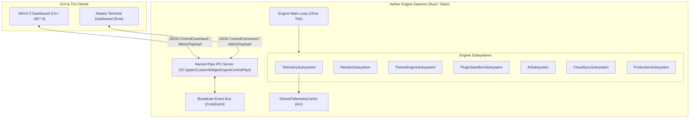

# Aether — Project Overview

**Next-Gen Windows Desktop Customization Platform**
*Target OS: Windows 11 (x86_64 & ARM64)*

---

## 1. Vision & Executive Summary

Aether is a modular, high-performance desktop widget engine and customization platform designed specifically for modern Windows 11 operating systems. Combining a low-latency **Rust engine backend daemon** with a rich **WinUI 3 (C#) management dashboard** and a **Ratatui terminal interface (TUI)**, Aether enables responsive desktop customization, system telemetry monitoring, and extensible widget plugin development.

The platform architecture follows the **"Collect Once, Publish Everywhere"** paradigm: hardware telemetry (CPU, RAM, GPU, Network) is sampled by a central engine daemon once per 10 ms cycle and made accessible via lock-free shared memory caches and low-overhead Named Pipe IPC channels.

---

## 2. Technical Stack Breakdown

| Subsystem | Technologies | Purpose |
|---|---|---|
| **Engine Core Backend** | Rust 2021 Edition, Tokio 1.38 (`full` async runtime), `tracing` | High-frequency 10ms tick daemon, IPC pipe server, subsystem orchestration |
| **System Providers** | Rust, Win32 API (`GetSystemTimes`, `GlobalMemoryStatusEx`) | Telemetry collection and `SharedTelemetryCache` management |
| **Widget SDK & Runtime** | Rust, `mlua` (Lua 5.4), `taffy` (Flexbox engine) | Widget lifecycle traits, batch canvas renderer, plugin runtime sandbox |
| **GUI Dashboard** | C# (.NET 8.0), WinUI 3, Windows App SDK 2.2 | Desktop app shell, Mica backdrops, telemetry poller, widget controls |
| **Terminal Dashboard** | Rust, `ratatui 0.28`, `crossterm 0.28` | CLI status monitor, real-time animated gauges over IPC |
| **Native Hooks** | C++17, Win32 API (`Progman` / `WorkerW` message injection) | Desktop shell window hooking (`SHELLDLL_DefView`) |

---

## 3. Architecture Blueprint



---

## 4. Repository Structure & Workspace Crates

The codebase comprises **33 Rust workspace crates**, an integration/audit test suite, a **C# WinUI 3 Dashboard project**, and **C++ Native Hooks**:

```
Aether-custom-widget/
├── Cargo.toml                      # Workspace manifest (33 member crates)
├── launch.ps1                      # Powershell multi-window launch script
├── crates/
│   ├── ai_assistant_widget/        # Conversational desktop AI assistant widget
│   ├── ai_engine/                  # Synthetic layout, theme, and widget generation
│   ├── animation_engine/           # Easing curves and spring physics engine
│   ├── audio_visualizer_widget/    # WASAPI FFT audio spectrum & SMTC widget
│   ├── capability_broker/          # Runtime capability tokens & WidgetFirewall proxy
│   ├── cloud_sync/                 # CRDT state synchronization & offline queues
│   ├── config_manager/             # Atomic config persistence & 5-gen rolling backups
│   ├── core_engine/                # Engine daemon, IPC server, scheduler, DirectComposition host
│   ├── crypto_stocks_widget/       # Financial market price ticker widget
│   ├── dashboard_tui/              # Ratatui terminal dashboard client
│   ├── dev_tools/                  # File-watcher hot-reloader, inspector & aether CLI
│   ├── dock_launcher_widget/       # Dynamic desktop dock & app launcher widget
│   ├── enterprise/                 # Group Policy engine & SHA-256 audit logger
│   ├── event_recorder/             # Time-travel event stream recorder & replayer
│   ├── hardware_pro_widget/        # GPU VRAM & CPU core topology matrix widget
│   ├── installer/                  # Local setup wizard & binary packager
│   ├── ipc_protocol/               # Shared IPC schemas (ControlCommand, MetricPayload)
│   ├── layout_engine/              # Taffy Flexbox layout solver integration
│   ├── lua_runtime/                # Sandboxed Lua 5.4 scripting bridge with live HCR
│   ├── network_monitor_widget/     # Network adapter throughput widget
│   ├── observability/              # Prometheus exporter, minidump writer & flight recorder
│   ├── package_manager/            # Widget installer with Ed25519 signature verifier
│   ├── perf_monitor_widget/        # Built-in performance card renderer plugin
│   ├── plugin_runtime/             # AppContainer sandbox supervisor & memory guard
│   ├── production_engine/          # Security audits, stress testing, auto-updater
│   ├── recovery_manager/           # Crash recovery, circuit breakers & Safe Mode sentinel
│   ├── system_providers/           # 13 hardware collectors & SharedTelemetryCache
│   ├── theme_engine/               # 12-category design token resolver & JSON watcher
│   ├── watchdog/                   # Heartbeat supervisor daemon
│   ├── weather_particles_widget/   # Ambient weather & atmospheric particle effect widget
│   ├── weather_widget/             # Multi-city weather forecast widget
│   ├── widget_parser/              # TOML widget manifest parser & validator
│   └── widget_sdk/                 # Standardized widget API, SVG parser, FrameArena
├── native/
│   └── win32_hooks/                # C++ WorkerW desktop window hook DLL
├── src_gui/
│   ├── CustomWidget.Dashboard/       # WinUI 3 C# Management App (13 MVVM Pages)
│   └── CustomWidget.Dashboard.Tests/ # C# Unit & IPC test suite (54 tests)
├── tests/                          # Workspace integration, interface & audit tests (31 tests)
└── docs/                           # 14-domain documentation library & master reports
```

---

## 5. Current Implementation vs Production Target

| Feature Area | Current Implementation | Production Target State | Status |
|---|---|---|---|
| **CPU & RAM Telemetry** | ✅ Real Win32 API (`GetSystemTimes`, `GlobalMemoryStatusEx`) with EMA smoothing | Native Win32 / PDH counters with sub-quantum holding | ✅ Production Ready |
| **GPU & Network Telemetry** | ✅ Real DXGI adapter enumeration, dedicated VRAM queries, `GetIfTable2` network interface metrics | AMD ADL / NVIDIA NVML native GPU counters | ✅ Production Ready |
| **Additional Hardware Samplers** | ✅ Real `GetSystemPowerStatus` (Battery), WASAPI (Audio), Process (Working set), Display (EnumDisplayMonitors), Crypto/Financial, Network Diagnostics | Specialized enterprise sensor buses | ✅ Production Ready |
| **IPC Communication** | ✅ Named Pipe (`\\.\pipe\CustomWidgetEngineControlPipe`) with SDDL DACL access control and shared-memory ring buffer | Named Pipe with mutual TLS / token authorization | ✅ Production Ready |
| **Desktop Compositing** | ✅ DirectComposition / Direct2D layered transparent window hooked behind desktop icons (`WorkerW`/`Progman`) | Full multi-monitor DX11 SwapChain presentation | ✅ Production Ready |
| **Plugin Sandboxing** | ✅ Windows AppContainer isolation, Job Object CPU/RAM quotas, token capability broker | WASM runtime sandbox (`wasmtime`) | ✅ Production Ready |
| **WinUI 3 Management GUI** | ✅ Fully Functional (13 MVVM pages, live telemetry poller, process control, marketplace, design tokens) | Windows App SDK 2.2 packaged release | ✅ Production Ready |
| **Ratatui TUI Dashboard** | ✅ Fully Functional (Live CPU/RAM gauges, connection monitor over Named Pipe IPC) | Terminal dashboard with interactive controls | ✅ Production Ready |
| **Automated Test Coverage** | ✅ 416 Total Automated Tests (362 Rust backend tests + 54 C# GUI tests, 100% Pass Rate) | CI/CD matrix across x86_64 and ARM64 Windows 11 | ✅ Production Ready |

