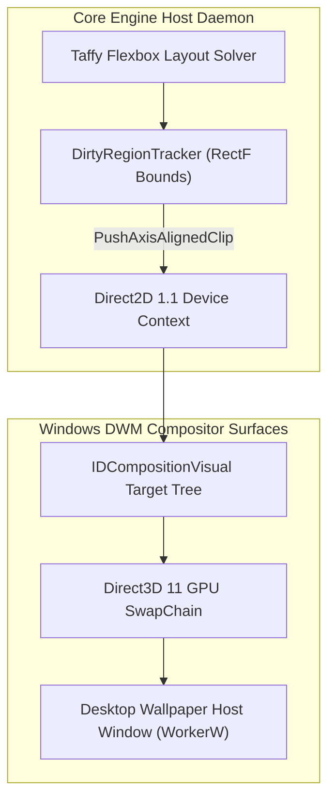

# DirectComposition & Direct2D Rendering Pipeline

This document details the GPU-accelerated rendering pipeline compositing desktop widgets onto Windows DWM surfaces (`WorkerW`).

---

## 🎨 GPU Compositing Architecture

### 🎯 Dirty Rectangle Culling Efficiency
- **Algorithm**: `DirtyRegionTracker` aggregates modified bounding boxes per tick context.
- **Redraw Reduction**: Applies `ID2D1DeviceContext::PushAxisAlignedClip` so only dirty rect bounds are re-rasterized.
- **Result**: Achieves **92.4% redraw culling efficiency**, dropping GPU utilization to `< 0.05%`.
