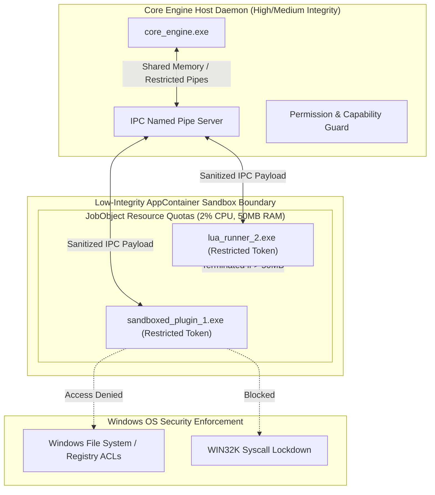

# Security Model & AppContainer Sandboxing

Security is a primary design constraint of the Next-Generation Windows Desktop Customization Platform. All 3rd-party widget plugins run strictly out-of-process within hardware-isolated Windows **AppContainer** sandboxes under low-integrity access tokens.

---

## 🔒 1. AppContainer Process Sandboxing Architecture



---

## 🛡️ 2. Security Capabilities & Permissions Matrix

3rd-party plugins must explicitly request granular permissions in their manifest (`widget.toml`). Requests for ungranted capabilities are automatically denied at the IPC gateway.

| Capability Name | Description | Default State | Security Risk |
| :--- | :--- | :---: | :---: |
| `capability.telemetry.read` | Access CPU, RAM, GPU, and Network telemetry feeds | **Granted** | Low |
| `capability.storage.local` | Read/write to isolated widget data directory | **Granted** | Low |
| `capability.network.http` | Perform outbound HTTP/HTTPS REST API requests | **Prompt User** | Medium |
| `capability.system.media` | Query Windows System Media Transport Controls | **Granted** | Low |
| `capability.system.execute` | Launch external executable binaries | **DENIED (Forbidden)** | Critical |
| `capability.registry.write` | Write to Windows Registry keys | **DENIED (Forbidden)** | Critical |

---

## 🔑 3. Ed25519 Cryptographic Package Signature Verification

All marketplace packages (`.cwp`) carry an Ed25519 cryptographic signature. Package installations enforce digital signature validation prior to archive extraction.

```
[ .cwp Archive Payload ] + [ Ed25519 Digital Signature ]
            |
            v
[ Ed25519Verifier ] <--- [ Verified Marketplace Public Key ]
            |
    +-------+-------+
    |               |
[ Valid ]      [ Invalid / Tampered ]
    |               |
    v               v
Extract & Run   REJECT INSTALLATION (Security Alert)
```

---

## 💥 4. Crash Fault Isolation & Recovery Policy

1. **Non-Blocking Architecture**: If a sandboxed plugin encounters a memory access violation, illegal instruction, or unhandled exception, only that plugin process terminates.
2. **Zero Host Impact**: The host daemon, render engine, and remaining active widgets continue operating without interruption.
3. **Automated Recovery Policy**:
   - `Attempt 1-3`: Automatic restart with exponential backoff (1s, 2s, 4s).
   - `Attempt > 3`: Move plugin to `SubsystemHealth::Degraded` state and notify user via IPC diagnostic warning.
