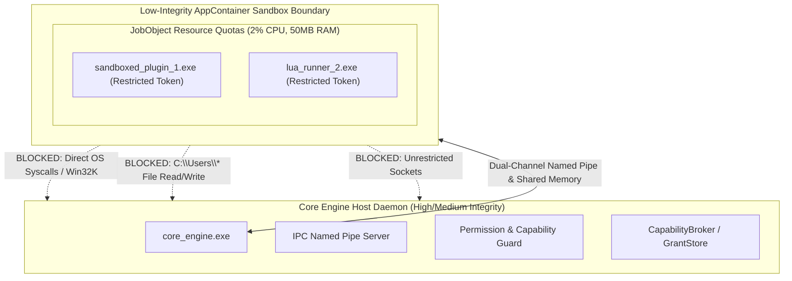

# Security Model & AppContainer Sandboxing

Security is a primary design constraint of the Next-Generation Windows Desktop Customization Platform (**Aether**). All 3rd-party widget plugins run strictly out-of-process within hardware-isolated Windows **AppContainer** sandboxes under low-integrity access tokens.

---

## 1. AppContainer Process Sandboxing Architecture



### 1.1 Integrity Levels & Token Restrictions
- **Host Process Integrity**: Medium / High Integrity (`core_engine.exe`).
- **Sandbox Integrity**: Low Integrity SID (`S-1-15-2-...` AppContainer profile SID).
- **Process Mitigation Policies**:
  - `PROCESS_CREATION_MITIGATION_POLICY_WIN32K_DISABLE` — Blocks Win32k GDI/USER kernel syscall escalation.
  - `PROCESS_CREATION_MITIGATION_POLICY_IMAGE_LOAD_NO_REMOTE` — Blocks loading DLLs from remote UNC shares.
  - `PROCESS_CREATION_MITIGATION_POLICY_EXTENSION_POINT_DISABLE` — Disables legacy Windows hook DLL injection.

---

## 2. JobObject Resource Quotas

Every sandboxed plugin process is bound to a dedicated Windows `JobObject` configured with strict kernel limits:

| Resource | Hard Limit | Enforcement Action |
|:---|:---|:---|
| **CPU Rate** | Max 2.0% per plugin | Kernel throttling (`JOBOBJECT_CPU_RATE_CONTROL_INFORMATION`) |
| **Commit Memory Limit** | 50.0 MB Working Set | Immediate allocation rejection (`JOB_OBJECT_LIMIT_COMMIT_ALLOCATION`) |
| **Process Count** | 1 Process per Sandbox | Subprocess spawning blocked (`JOB_OBJECT_LIMIT_ACTIVE_PROCESS`) |
| **Security Limits** | Low-Integrity Restricted | Token SID filtering and capability token enforcement |

---

## 3. Capability Permission Model & Firewall

Plugins declare required capabilities in their `widget.toml` manifest:
```toml
[permissions]
network = false
filesystem = false
gpu_acceleration = true
telemetry_read = true
```

The `CapabilityBroker` and `WidgetFirewall` dynamically inspect and validate all capability requests prior to granting IPC token access.
