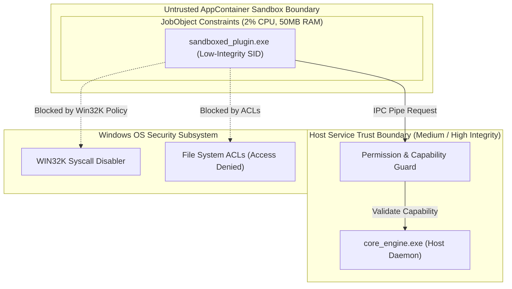

# Threat Model & STRIDE Security Analysis

This document details the threat modeling, attack surface analysis, and security controls enforcing zero-trust plugin isolation.

---

## 🛡️ STRIDE Threat Analysis Matrix

| Threat Category | Threat Description | Attack Vector | Security Mitigations & Countermeasures |
| :--- | :--- | :--- | :--- |
| **Spoofing** | Untrusted binary posing as official marketplace widget package | Package tampering or MITM injection | **Ed25519 Cryptographic Signatures**: All `.cwp` archives are verified prior to extraction. |
| **Tampering** | Malicious plugin modifying host engine RAM or widget configs | Memory injection or shared memory write | **Low-Integrity SIDs**: AppContainer token SIDs block write access to host memory & files. |
| **Repudiation** | Unverified plugin execution without audit trail | Unauthorized API access | **ETW Tracing & Audit Log**: Security Auditor logs all capability requests to Windows Event Tracing. |
| **Information Disclosure** | Plugin reading user documents, SSH keys, or credentials | Directory traversal or unauthorized read | **AppContainer ACL Enforcement**: Default sandbox access denied to `C:\Users\*`. |
| **Denial of Service** | Malicious widget executing infinite loops or memory allocations | CPU hogging or RAM exhaustion | **JobObject Limits**: Hard caps enforce max **2% CPU** and **50 MB RAM** per plugin. |
| **Elevation of Privilege** | Plugin escaping sandbox via Win32K kernel vulnerability | Win32K syscall escalation | **WIN32K Lockdown**: `PROCESS_CREATION_MITIGATION_POLICY_WIN32K_DISABLE` applied. |

---

## 🔒 Security Architecture Diagram

