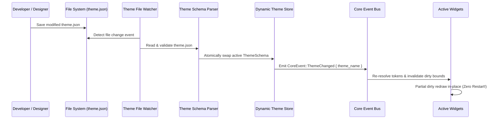

# Theme Engine Specification (`theme.json`)

The **Aether 7.4 Theme Engine** provides declarative 12-category design token management, theme inheritance (`extends`), `MaterialEngine` surfaces (`Mica`, `Acrylic`, `Glass`), dynamic WCAG contrast validation, and centralized accessibility overrides (`High Contrast`, `Reduce Motion`). All themes support **Hot Reloading** without restarting the host daemon process or terminating sandboxed widget plugins.

---

## 🎨 Complete `theme.json` Schema Reference

```json
{
  "metadata": {
    "id": "theme.cyberpunk.neon",
    "name": "Cyberpunk Neon",
    "author": "Design Studio",
    "version": "1.0.0",
    "description": "High-contrast neon theme for night setups"
  },
  "extends": "theme.base.dark",
  "tokens": {
    "colors": {
      "accent": "#FF007F",
      "background": "#0D0221E6"
    },
    "spacing": {
      "md": 12.0
    }
  },
  "colors": {
    "theme.accent": "#FF007F",
    "theme.accent_hover": "#FF3399",
    "theme.background": "#0D0221E6",
    "theme.card_background": "#190A38E6",
    "theme.text_primary": "#00F5D4",
    "theme.text_secondary": "#7B2CBF",
    "theme.border": "#FF007F80"
  },
  "fonts": {
    "default": {
      "family": "Segoe UI",
      "size_pt": 14.0,
      "weight": "Normal",
      "fallback": "Arial"
    },
    "heading": {
      "family": "Roboto",
      "size_pt": 20.0,
      "weight": "Bold",
      "fallback": "Segoe UI"
    },
    "monospace": {
      "family": "Consolas",
      "size_pt": 12.0,
      "weight": "Normal",
      "fallback": "Courier New"
    }
  },
  "icons": {
    "cpu": "assets/icons/cpu_neon.svg",
    "ram": "assets/icons/ram_neon.svg",
    "gpu": "assets/icons/gpu_neon.svg",
    "network": "assets/icons/net_neon.svg"
  },
  "widgets": {
    "widget.sys_monitor.v1": {
      "card_color": "#190A38E6",
      "border_glow": "true",
      "progress_bar_color": "#00F5D4"
    }
  },
  "layouts": {
    "default": {
      "padding": 12.0,
      "gap": 8.0,
      "corner_radius": 10.0,
      "backdrop": "Mica"
    },
    "compact": {
      "padding": 6.0,
      "gap": 4.0,
      "corner_radius": 4.0,
      "backdrop": "Acrylic"
    }
  },
  "animations": {
    "default": {
      "stiffness": 180.0,
      "damping": 12.0,
      "mass": 1.0,
      "easing": "EaseOutQuad"
    },
    "snappy": {
      "stiffness": 300.0,
      "damping": 20.0,
      "mass": 0.8,
      "easing": "EaseOutQuad"
    }
  }
}
```

---

## ⚡ Live Hot Reloading Pipeline ("No Restart")



### Hot Reload Key Benefits
- **Zero Host Downtime**: The host daemon continues running seamlessly.
- **Zero Widget State Loss**: Widget internal variables and telemetry buffers remain intact.
- **Microsecond Token Swap**: `DynamicThemeStore` performs atomic memory pointer swaps in `< 100 microseconds`.
