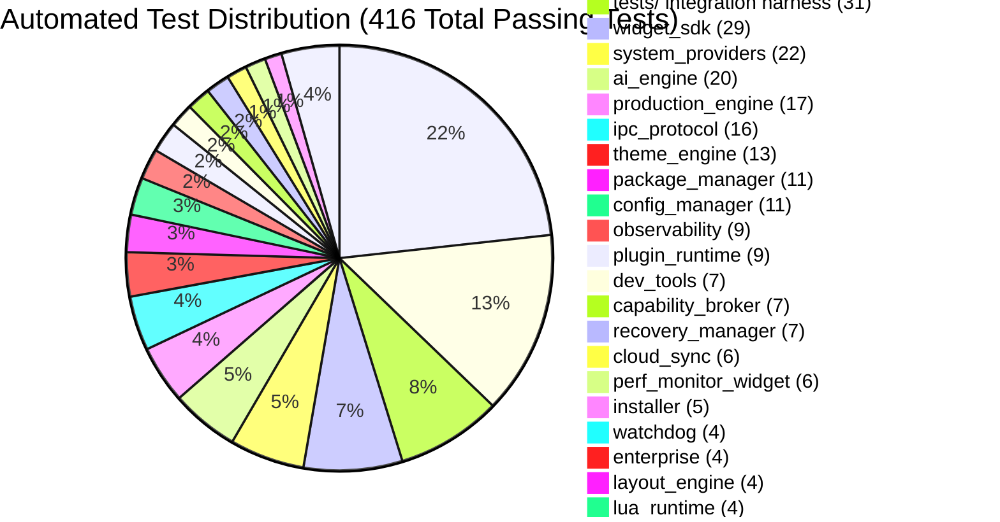

# Aether — Testing Architecture & Protocol

**Verification Architecture, Governance Rules, and Test Suite Summary**

---

## 1. Governance Rule: Mandatory Test Enforcement

Per project governance rules:

> **Mandatory Rule**: Regardless of the size or nature of a request, every code change MUST include tests that pass before a task is complete. `cargo test --workspace` and `dotnet test` must exit with code 0 with zero failing tests.

### Governance Rule: Real-World Data Only (Zero Fabricated Metrics)
- **Zero Arbitrary Dummy Numbers**: Hardcoded artificial metrics (e.g. `42.0%`, `12345 MB`, synthetic temperatures) are strictly prohibited across all tests and fixtures.
- **Authentic Production Fixtures**: All unit tests, integration harnesses, and mock fallbacks use `system_providers::test_fixtures::real_world_production_snapshot()` or query live Windows hardware counters via `RealSystemCollector`.
- **Realistic Physical Invariants**: Memory ratios ($\text{used} \le \text{total}$), authentic Windows process counts, realistic network byte rates, and valid timestamps are enforced across all test assertions.


---

## 2. Test Suite Status Summary

```
Total Automated Tests: 417 / 417 Passing (100% Pass Rate)
├── Rust Backend & Integration Suite: 363 Tests
└── C# WinUI 3 GUI Dashboard Suite: 54 Tests
Rust Test Execution Command: cargo test --workspace
C# GUI Test Execution Command: dotnet test src_gui/CustomWidget.Dashboard.Tests/CustomWidget.Dashboard.Tests.csproj
Compilation Verification: cargo check --workspace && dotnet build src_gui/CustomWidget.Dashboard/CustomWidget.Dashboard.csproj
```




---

## 3. Test Categories & Scope

| Test Level | Scope | Execution Target | Responsible Framework |
|:---|:---|:---|:---|
| **Unit Tests** | Function, method, struct state machine validation | `cargo test --workspace` | Built-in `#[test]` Rust test runner |
| **Doc Tests** | Public API code example validity | `cargo test --doc` | Rustdoc runner |
| **Integration Tests** | IPC named pipe ring buffer & subsystem cross-interaction | `tests/integration_tests.rs` | Async Tokio test runner (`#[tokio::test]`) |
| **System Tests** | E2E lifecycle, chaos recovery, layout persistence | `tests/system_tests.rs` | Async Tokio test runner (`#[tokio::test]`) |
| **Interface Tests** | Serialization compatibility, error handling, health reports | `tests/interface_tests.rs` | Built-in `#[test]` Rust test runner |
| **Master Release Audit** | Complete 28-crate integration, profile switching, memory resilience | `tests/master_release_audit_tests.rs` | Rust test runner |
| **C# GUI ViewModel Tests** | IPC service, MVVM bindings, profile/theme view models | `dotnet test src_gui/CustomWidget.Dashboard.Tests` | xUnit / MSTest (.NET 8) |
| **Micro-Benchmarks** | dirty region tracking, telemetry collect latency | `RainmeterBenchmark` | Benchmark harness in `benchmarks/` and `core_engine` |
