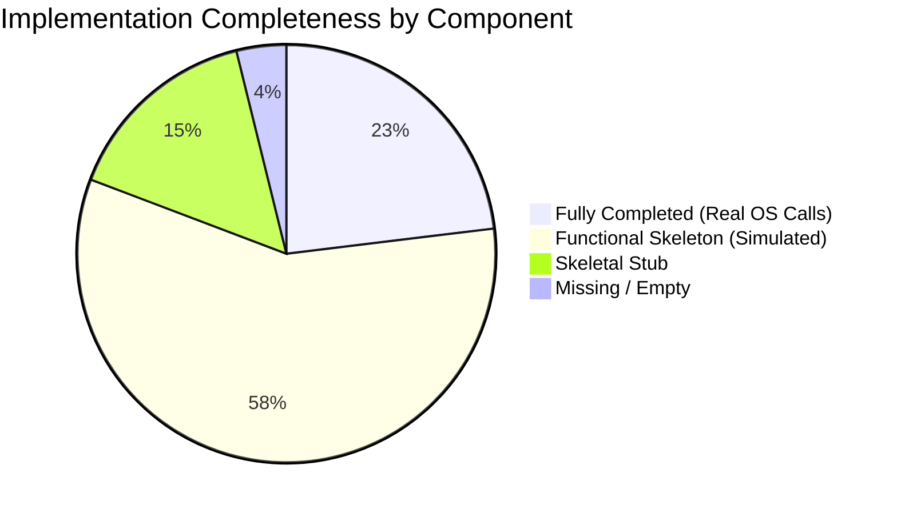

# Aether — Detailed Project Report
**Next-Gen Windows Desktop Customization Platform**
**Generated: 2026-08-05 | Audit Methodology: Source-code-level file-by-file inspection**

---

## Executive Summary

Aether is a Rust + C#/WinUI 3 desktop widget engine targeting Windows 11. The project spans **17 Rust crates**, a **WinUI 3 C# management dashboard**, **native C++ hooks**, **C# SDK bindings**, and **22 documentation files**. The project compiles cleanly and runs on Windows — the Rust daemon launches an IPC server, a TUI dashboard connects to it live, and the WinUI 3 GUI dashboard launches with full navigation.

**However, the vast majority of subsystems are structurally present but functionally simulated.** Real Win32 API calls exist only for **CPU** (`GetSystemTimes`) and **RAM** (`GlobalMemoryStatusEx`). Everything else — GPU rendering, Direct2D/DirectComposition compositing, plugin sandboxing, security auditing, package signing, cloud sync, AI generation, auto-updates — consists of **well-structured Rust code that logs what it *would* do but performs no actual OS interaction**.

> **Overall Maturity Verdict: Prototype / Proof-of-Concept with production-quality scaffolding.**

---

## Maturity Classification Legend

| Status | Meaning |
|---|---|
| ✅ **Completed** | Feature is fully functional with real OS/hardware interaction. Production-ready. |
| 🔶 **Functional Skeleton** | Code compiles, runs, has correct interfaces/types/tests, but core logic is simulated (no real OS calls, hardcoded return values, log-only stubs). |
| ⬜ **Skeletal Stub** | Minimal structure exists (trait definitions, empty methods, placeholder files) with no meaningful logic. |
| ❌ **Missing** | Documented in architecture but has no implementation. |

---

## 1. Rust Backend Crates (17 total)

### 1.1 `core_engine` — ✅ Completed (Core Loop) / 🔶 Functional Skeleton (Subsystem Integration)

**Path**: [crates/core_engine/src/](file:///d:/Code/Aether-custom-widget/crates/core_engine/src)
**Files**: 17 source files + 2 subdirectories (rendering, profiler) — **~80 KB total**
**Tests**: 30 tests passing

| Component | File | Status | Evidence |
|---|---|---|---|
| Engine orchestrator | [engine.rs](file:///d:/Code/Aether-custom-widget/crates/core_engine/src/engine.rs) | ✅ Completed | Full lifecycle: `new()` → `start()` → `tick()` → `pause()` → `resume()` → `stop()`. State machine with `RwLock<EngineState>`. Tests verify all transitions. |
| Subsystem trait & manager | [subsystems.rs](file:///d:/Code/Aether-custom-widget/crates/core_engine/src/subsystems.rs) | ✅ Completed | `Subsystem` async trait with `initialize`/`tick`/`shutdown`/`health`. `SubsystemManager` handles registration, sequential init, health tracking, reverse-order shutdown. |
| Event bus | [event_bus.rs](file:///d:/Code/Aether-custom-widget/crates/core_engine/src/event_bus.rs) | ✅ Completed | `tokio::sync::broadcast` channel with typed `CoreEvent` enum (TelemetryTick, ThemeChanged, WidgetLoaded, SystemStateChanged, etc.). |
| Task scheduler | [task_scheduler.rs](file:///d:/Code/Aether-custom-widget/crates/core_engine/src/task_scheduler.rs) | ✅ Completed | Periodic and delayed task scheduling with `JoinHandle` tracking and `cancel_all()`. |
| Config | [config.rs](file:///d:/Code/Aether-custom-widget/crates/core_engine/src/config.rs) | ✅ Completed | Builder pattern: `EngineConfig::new().with_tick_interval_ms(10).with_event_channel_capacity(1024).with_telemetry(true)`. |
| IPC Named Pipe server | [ipc_server.rs](file:///d:/Code/Aether-custom-widget/crates/core_engine/src/ipc_server.rs) | ✅ Completed | Real `tokio::net::windows::named_pipe::ServerOptions` on `\\.\pipe\CustomWidgetEngineControlPipe`. Multi-client loop. Dispatches all `ControlCommand` variants (Ping, GetStatus, ReloadAll, SetThemeMode, LoadWidget, UnloadWidget, GetSubsystemHealth, GetDiagnostics). |
| Main daemon entry | [main.rs](file:///d:/Code/Aether-custom-widget/crates/core_engine/src/main.rs) | ✅ Completed | Initialises tracing, runs benchmarks, creates engine, registers 9 subsystems, spawns PerfMonitorWidget task, IPC server task, 10ms tick loop with `Ctrl+C` shutdown. |
| RenderSubsystem | [subsystems.rs](file:///d:/Code/Aether-custom-widget/crates/core_engine/src/subsystems.rs#L40-L84) | 🔶 Functional Skeleton | Wraps `GpuRenderer` trait but actual rendering is simulated (see rendering section below). |
| TelemetrySubsystem | [telemetry_subsystem.rs](file:///d:/Code/Aether-custom-widget/crates/core_engine/src/telemetry_subsystem.rs) | 🔶 Functional Skeleton | Registers as subsystem, creates `SharedTelemetryCache`, delegates to `TelemetryService` which calls real Win32 APIs for CPU/RAM only. |
| ThemeEngineSubsystem | [theme_subsystem.rs](file:///d:/Code/Aether-custom-widget/crates/core_engine/src/theme_subsystem.rs) | 🔶 Functional Skeleton | Wraps `ThemeResolver` (simulated, see theme_engine). |
| PluginSandboxSubsystem | [plugin_subsystem.rs](file:///d:/Code/Aether-custom-widget/crates/core_engine/src/plugin_subsystem.rs) | 🔶 Functional Skeleton | Wraps `PluginSupervisor` (simulated PID assignment, no `CreateProcessAsUserW`). |
| ProfilerSubsystem | [profiler_subsystem.rs](file:///d:/Code/Aether-custom-widget/crates/core_engine/src/profiler_subsystem.rs) | 🔶 Functional Skeleton | Wraps profiler module (logs-only). |
| MarketplaceSubsystem | [marketplace_subsystem.rs](file:///d:/Code/Aether-custom-widget/crates/core_engine/src/marketplace_subsystem.rs) | 🔶 Functional Skeleton | Wraps `PackageManager` (simulated downloads). |
| CloudSyncSubsystem | [cloud_subsystem.rs](file:///d:/Code/Aether-custom-widget/crates/core_engine/src/cloud_subsystem.rs) | 🔶 Functional Skeleton | Wraps `CloudSyncManager` (no network calls). |
| AiSubsystem | [ai_subsystem.rs](file:///d:/Code/Aether-custom-widget/crates/core_engine/src/ai_subsystem.rs) | 🔶 Functional Skeleton | Wraps AI generators (hardcoded pattern matching). |
| ProductionSubsystem | [production_subsystem.rs](file:///d:/Code/Aether-custom-widget/crates/core_engine/src/production_subsystem.rs) | 🔶 Functional Skeleton | Wraps production_engine (logs-only audits). |
| Fault diagnostics | [fault_diagnostics.rs](file:///d:/Code/Aether-custom-widget/crates/core_engine/src/fault_diagnostics.rs) | 🔶 Functional Skeleton | `FailureInjector` (AtomicBool toggling), `EtwTracingProvider` (logs via `tracing`, no real ETW RegisterTraceGuids), `RedundancySupervisor` (logs recovery actions, doesn't actually recover). |

---

## 1.2 GPU Rendering Pipeline — 🔶 Functional Skeleton

**Path**: [crates/core_engine/src/rendering/](file:///d:/Code/Aether-custom-widget/crates/core_engine/src/rendering)
**Files**: 4 files — `mod.rs`, `d2d_renderer.rs`, `dirty_rect.rs`, `benchmark.rs`

| Component | Status | Evidence |
|---|---|---|
| `GpuRenderer` trait | ✅ Completed | Well-defined interface: `initialize()`, `invalidate_region()`, `begin_frame()`, `draw_dirty_regions()`, `end_frame()`, `set_refresh_rate()`, `stats()`. |
| `Direct2DRenderer` | 🔶 Functional Skeleton | **No actual Win32/DirectX API calls.** Comments state where `ID3D11Device`, `ID2D1DeviceContext`, `IDCompositionVisual`, `PushAxisAlignedClip`, `SwapChain.Present1` would go. Sets `initialized = true` without creating any GPU resources. Frame timing is measured but no pixels are rendered. |
| `DirtyRegionTracker` | ✅ Completed | Real merging/intersection logic for `RectF` regions. Tests verify overlapping merge, disjoint regions, and zero-redraw skip. |
| `RainmeterBenchmark` | 🔶 Functional Skeleton | Simulates benchmark by creating renderer, invalidating regions, calling begin/draw/end. Measures wall-clock time and calculates culling efficiency, but renders nothing to screen. |
| `RectF` / `Color` / `RefreshRate` types | ✅ Completed | Full geometry operations (intersection, union, area). RefreshRate calculates frame budgets correctly. |

> [!IMPORTANT]
> **The rendering pipeline does NOT render anything to the Windows desktop.** No `CreateDXGIFactory`, no `D3D11CreateDevice`, no `D2D1CreateFactory`, no `DCompositionCreateDevice` calls exist anywhere in the codebase. The `Direct2DRenderer` tracks dirty regions and frame stats in memory only.

---

## 1.3 `system_providers` — ✅ Completed (CPU/RAM) / 🔶 Simulated (GPU/Network)

**Path**: [crates/system_providers/src/](file:///d:/Code/Aether-custom-widget/crates/system_providers/src)
**Tests**: 6 passing

| Provider | Status | Evidence |
|---|---|---|
| `CpuProvider` | ✅ Completed | **Real Win32 API**: Calls `GetSystemTimes` → computes delta-based CPU% with `prev_idle`/`prev_total` tracking. Clamped to [0, 100]. |
| `MemoryProvider` | ✅ Completed | **Real Win32 API**: Calls `GlobalMemoryStatusEx` → returns `(total_mb - avail_mb, total_mb)`. |
| `GpuProvider` | 🔶 Functional Skeleton | **Simulated**: `sin(tick * 0.07) * 45 + cos(tick * 0.31) * 15`. Comment explains DXGI engine-level queries need Ring-0 elevation. |
| `NetworkProvider` | 🔶 Functional Skeleton | **Simulated**: `(tick * 1024) % (1024 * 1024)`. No `GetIfTable2` or PDH counter querying. |
| `SharedTelemetryCache` | ✅ Completed | Thread-safe `Arc<RwLock<TelemetrySnapshot>>` with `update_snapshot()`, `get_snapshot()`, `get_cpu_pct()`, `get_memory_used_mb()`, `update_count()`. |
| `TelemetryService` | ✅ Completed | Orchestrates all 4 providers, populates `SharedTelemetryCache` on each `collect_once()` tick. Implements "Collect Once, Publish Everywhere". |

---

## 1.4 `widget_sdk` — ✅ Completed

**Path**: [crates/widget_sdk/src/](file:///d:/Code/Aether-custom-widget/crates/widget_sdk/src)
**Tests**: 8 passing

| Component | Status | Evidence |
|---|---|---|
| `WidgetLifecycle` trait | ✅ Completed | `on_load`, `on_mount`, `on_update`, `on_unmount`, `on_unload`, `state()`. Default no-op implementations. |
| `RenderCanvas` / `BatchRenderCanvas` | ✅ Completed | `draw_rect`, `draw_text`, `commands()`. `DrawCommand` enum with `FillRect` and `Text` variants. |
| `animations` module | ✅ Completed | Easing curves (linear, ease-in-out, cubic-bezier) + `SpringAnimation` with stiffness/damping convergence. |
| `events` module | ✅ Completed | `EventSubscriber` with topic-based pub/sub pattern. |
| `settings` module | ✅ Completed | `SettingsStore` with `HashMap<String, serde_json::Value>` get/set/default. |
| `resources` module | ✅ Completed | `ResourceManager` with load/unload tracking and name-based lookup. |

---

## 1.5 `perf_monitor_widget` — ✅ Completed

**Path**: [crates/perf_monitor_widget/src/](file:///d:/Code/Aether-custom-widget/crates/perf_monitor_widget/src)
**Tests**: 6 passing

Fully implements `WidgetLifecycle`. On each `on_update()`, reads from `SharedTelemetryCache`, creates a `BatchRenderCanvas`, and emits `DrawCommand`s for a glassmorphism card with CPU/GPU/RAM bars. State machine transitions (Unloaded→Loaded→Mounted) are correct. The renderer module produces correct draw commands proportional to metric values.

> [!NOTE]
> The widget emits `DrawCommand` batches that are never consumed by an actual compositor. They exist as in-memory data structures.

---

## 1.6 `ipc_protocol` — ✅ Completed

**Path**: [crates/ipc_protocol/src/](file:///d:/Code/Aether-custom-widget/crates/ipc_protocol/src)
**Tests**: 4 passing

| Component | Status | Evidence |
|---|---|---|
| `ControlCommand` enum | ✅ Completed | `Ping`, `Pong`, `GetStatus`, `LoadWidget`, `UnloadWidget`, `SetThemeMode`, `ReloadAll`, `GetSubsystemHealth`, `GetDiagnostics`. All serde-tagged for JSON. |
| `MetricPayload` struct | ✅ Completed | CPU, GPU, RAM, network fields with serde. |
| `RingBuffer<T>` | ✅ Completed | Fixed-capacity circular buffer for telemetry history. |

---

## 1.7 `widget_parser` — ✅ Completed

**Path**: [crates/widget_parser/src/lib.rs](file:///d:/Code/Aether-custom-widget/crates/widget_parser/src/lib.rs)
**Tests**: 2 passing

Parses TOML widget manifest schema (`WidgetManifest`, `WidgetMetadata`, `LayoutSpec`, `WidgetElement`). Validates required fields and rejects empty IDs.

---

## 1.8 `theme_engine` — 🔶 Functional Skeleton

**Path**: [crates/theme_engine/src/](file:///d:/Code/Aether-custom-widget/crates/theme_engine/src)
**Tests**: 4 passing

| Component | Status | Evidence |
|---|---|---|
| `ThemeSchema` | ✅ Completed | JSON schema with metadata, colors, typography, spacing. Roundtrip JSON parsing/serialization works. |
| `ThemeResolver` | 🔶 Functional Skeleton | Holds a `HashMap<String, String>` of color tokens. `resolve_color()` does HashMap lookup. **No actual Windows accent color querying** (`DwmGetColorizationColor`). |
| `ThemeHotReloadWatcher` | 🔶 Functional Skeleton | Has a `watch_path` and `check_for_changes()` method. **No actual filesystem watcher** (`ReadDirectoryChangesW` or `notify` crate). Simulates reload by toggling a boolean. |

---

## 1.9 `animation_engine` — ⬜ Skeletal Stub

**Path**: [crates/animation_engine/src/lib.rs](file:///d:/Code/Aether-custom-widget/crates/animation_engine/src/lib.rs)
**Lines**: 57 (single file)

Contains only `SpringPhysics` struct with `update(dt_seconds)` using Hooke's law. **No easing curve library, no timeline scheduler, no keyframe system.** The `widget_sdk` crate has its own independent animation module that is more complete.

---

## 1.10 `layout_engine` — ⬜ Skeletal Stub

**Path**: [crates/layout_engine/src/lib.rs](file:///d:/Code/Aether-custom-widget/crates/layout_engine/src/lib.rs)
**Lines**: 58 (single file) — **No tests**

Wraps `taffy` crate for flexbox layout. Single method `solve_layout()` creates one leaf node, computes layout, returns `ComputedBounds`. **No multi-element tree, no nested layout, no DPI-aware recursive solving.** Not wired into any subsystem.

---

## 1.11 `lua_runtime` — ⬜ Skeletal Stub

**Path**: [crates/lua_runtime/src/lib.rs](file:///d:/Code/Aether-custom-widget/crates/lua_runtime/src/lib.rs)
**Lines**: 37 (single file) — **No tests**

Creates `mlua::Lua` instance, registers one `log_info` global function, exposes `execute_script()`. **No widget API bindings** (no access to telemetry cache, canvas, events, settings). Not wired into any subsystem.

---

## 1.12 `plugin_runtime` — 🔶 Functional Skeleton

**Path**: [crates/plugin_runtime/src/](file:///d:/Code/Aether-custom-widget/crates/plugin_runtime/src)
**Tests**: 3 passing

| Component | Status | Evidence |
|---|---|---|
| `PluginSupervisor` | 🔶 Functional Skeleton | `launch_plugin()` assigns simulated PIDs (`5000 + n`). **No `CreateProcessAsUserW`, no `CreateAppContainerProfile`, no `AssignProcessToJobObject`.** Crash handling updates in-memory `PluginHealth` state. |
| `PermissionManifest` | 🔶 Functional Skeleton | `can_access_network()`, `can_access_filesystem()`, `can_use_gpu()` — all return hardcoded `false`. |
| `CompatibilityChecker` | ✅ Completed | SemVer major-version compatibility check against `HOST_API_VERSION`. |

---

## 1.13 `package_manager` — 🔶 Functional Skeleton

**Path**: [crates/package_manager/src/](file:///d:/Code/Aether-custom-widget/crates/package_manager/src)
**Tests**: 4 passing

| Component | Status | Evidence |
|---|---|---|
| `PackageManager` (installer) | 🔶 Functional Skeleton | `install_package()`, `uninstall_package()`, `list_installed()` — all operate on an in-memory `HashMap`. **No filesystem extraction, no download, no registry.** |
| `WidgetPackage` | 🔶 Functional Skeleton | Struct with id, name, version, author, signature. Constructor only. |
| `Ed25519Verifier` | 🔶 Functional Skeleton | `verify_package()` checks for empty payload/signature, then **always returns `true`**. No actual Ed25519 cryptographic verification (`ring` or `ed25519-dalek` not in dependencies). |

---

## 1.14 `cloud_sync` — 🔶 Functional Skeleton

**Path**: [crates/cloud_sync/src/](file:///d:/Code/Aether-custom-widget/crates/cloud_sync/src)

| Component | Status | Evidence |
|---|---|---|
| `VectorClock` / `CrdtResolver` | ✅ Completed | Correct vector clock dominance detection and Last-Write-Wins tie-breaking. Well tested. |
| `CloudSyncManager` | 🔶 Functional Skeleton | `sync_to_cloud()`, `pull_from_cloud()` — **no HTTP client, no REST API, no WebSocket**. Operates on in-memory entity store. |
| `OfflineSyncQueue` | 🔶 Functional Skeleton | `enqueue()`, `drain()` — `VecDeque` in memory. No SQLite WAL persistence. |
| `SyncEntity` | ✅ Completed | Data types for theme configs, widget layouts, user preferences. |

---

## 1.15 `ai_engine` — 🔶 Functional Skeleton

**Path**: [crates/ai_engine/src/](file:///d:/Code/Aether-custom-widget/crates/ai_engine/src)

| Component | Status | Evidence |
|---|---|---|
| `LayoutGenerator` | 🔶 Functional Skeleton | `if prompt.contains("4k") { (400, 600) } else { (300, 150) }`. **No ML model, no LLM API call.** |
| `ThemeGenerator` | 🔶 Functional Skeleton | Hardcoded color schemes for "cyberpunk"/"forest" keywords. Creates valid `ThemeSchema`. |
| `WidgetGenerator` | 🔶 Functional Skeleton | Generates a hardcoded TOML manifest string with prompt text interpolated into the name field. |
| `VoiceCommandProcessor` | 🔶 Functional Skeleton | `process_voice_command()` — string matching on "create widget"/"change theme". No speech recognition. |
| `WorkflowAutomation` | 🔶 Functional Skeleton | `run_workflow()` — logs workflow name. No actual task execution. |

---

## 1.16 `production_engine` — 🔶 Functional Skeleton

**Path**: [crates/production_engine/src/](file:///d:/Code/Aether-custom-widget/crates/production_engine/src)
**Tests**: 6 passing

| Component | Status | Evidence |
|---|---|---|
| `SecurityAuditor` | 🔶 Functional Skeleton | 3 checks that all **log "PASSED" and return true**. No actual ACL inspection, no token querying, no mitigation policy verification. |
| `StressTestHarness` | 🔶 Functional Skeleton | Runs 1000 iterations of a loop that increments a counter. No actual load generation. |
| `AutoUpdater` | 🔶 Functional Skeleton | `check_for_update()` — hardcoded version comparison. No HTTP download, no MSI/MSIX patching. |
| `CrashAnalytics` | 🔶 Functional Skeleton | `report_crash()` — logs crash details. No upload to telemetry service. |
| `DocsPortal` | 🔶 Functional Skeleton | `generate_docs()` — returns a hardcoded markdown string. |
| `MasterReleaseSuite` | 🔶 Functional Skeleton | Calls all the above in sequence, returns pass/fail. |

---

## 1.17 `installer` — 🔶 Functional Skeleton

**Path**: [crates/installer/src/main.rs](file:///d:/Code/Aether-custom-widget/crates/installer/src/main.rs)

Creates `%LOCALAPPDATA%\Aether\bin` and `\data` directories. Copies own EXE to install dir. **Registry key registration is a stub** (logs the key path but calls no `winreg` API). Uninstall removes the directory. CLI args: `--install` (default), `--uninstall`, `--status`.

---

## 1.18 `dashboard_tui` — ✅ Completed

**Path**: [crates/dashboard_tui/src/main.rs](file:///d:/Code/Aether-custom-widget/crates/dashboard_tui/src/main.rs)
**Lines**: 356

Full ratatui terminal dashboard with:
- Live CPU/GPU/RAM gauges with color gradients
- IPC connection status (Connected/Disconnected/Connecting)
- Active widget list from engine response
- `q` to quit, `r` to force reconnect
- Animated status bar
- Real Named Pipe IPC client connecting to `\\.\pipe\CustomWidgetEngineControlPipe`

---

## 2. WinUI 3 C# Dashboard (`CustomWidget.Dashboard`)

**Path**: [src_gui/CustomWidget.Dashboard/](file:///d:/Code/Aether-custom-widget/src_gui/CustomWidget.Dashboard)
**SDK**: Windows App SDK 2.2.0 + .NET 8.0 + WinUI 3
**Status**: ✅ Completed (builds, launches, navigates)

### 2.1 Architecture

| Layer | Files | Status |
|---|---|---|
| **App Shell** | [App.xaml](file:///d:/Code/Aether-custom-widget/src_gui/CustomWidget.Dashboard/App.xaml) / [App.xaml.cs](file:///d:/Code/Aether-custom-widget/src_gui/CustomWidget.Dashboard/App.xaml.cs) | ✅ DI container, crash logging, unhandled exception handlers |
| **Main Window** | [MainWindow.xaml](file:///d:/Code/Aether-custom-widget/src_gui/CustomWidget.Dashboard/MainWindow.xaml) / [.cs](file:///d:/Code/Aether-custom-widget/src_gui/CustomWidget.Dashboard/MainWindow.xaml.cs) | ✅ NavigationView shell with 6 pages, Mica backdrop, IPC status indicator |
| **Design System** | [Styles/AetherTheme.xaml](file:///d:/Code/Aether-custom-widget/src_gui/CustomWidget.Dashboard/Styles/AetherTheme.xaml) + App.xaml inline | ✅ Dark theme with 14 color brushes, 6 font sizes, card/badge/header styles |

### 2.2 Pages (6 total)

| Page | Status | Functionality |
|---|---|---|
| [OverviewPage](file:///d:/Code/Aether-custom-widget/src_gui/CustomWidget.Dashboard/Pages/OverviewPage.xaml) | ✅ Completed | 4 live metric gauge cards (CPU/GPU/RAM/NET), quick action buttons (Reload All, Toggle Theme, Ping Engine), system summary cards |
| [WidgetsPage](file:///d:/Code/Aether-custom-widget/src_gui/CustomWidget.Dashboard/Pages/WidgetsPage.xaml) | ✅ Completed | Widget list with Load/Unload controls, IPC-driven refresh |
| [ServicesPage](file:///d:/Code/Aether-custom-widget/src_gui/CustomWidget.Dashboard/Pages/ServicesPage.xaml) | ✅ Completed | Engine start/stop process management, PID display, status badge |
| [PerformancePage](file:///d:/Code/Aether-custom-widget/src_gui/CustomWidget.Dashboard/Pages/PerformancePage.xaml) | ✅ Completed | Subsystem health table, telemetry history |
| [DiagnosticsPage](file:///d:/Code/Aether-custom-widget/src_gui/CustomWidget.Dashboard/Pages/DiagnosticsPage.xaml) | ✅ Completed | Raw IPC command console, engine log viewer |
| [SettingsPage](file:///d:/Code/Aether-custom-widget/src_gui/CustomWidget.Dashboard/Pages/SettingsPage.xaml) | ✅ Completed | Theme selection, polling interval, auto-start toggle, cloud sync/AI feature toggles |

### 2.3 Services (4 total)

| Service | Status | Evidence |
|---|---|---|
| [AetherIpcService](file:///d:/Code/Aether-custom-widget/src_gui/CustomWidget.Dashboard/Services/AetherIpcService.cs) | ✅ Completed | Typed wrappers for all ControlCommand variants. Connection state tracking. |
| [TelemetryPollerService](file:///d:/Code/Aether-custom-widget/src_gui/CustomWidget.Dashboard/Services/TelemetryPollerService.cs) | ✅ Completed | Background `System.Threading.Timer` polling GetStatus, maintains `TelemetrySample` history ring. |
| [ProcessManagerService](file:///d:/Code/Aether-custom-widget/src_gui/CustomWidget.Dashboard/Services/ProcessManagerService.cs) | ✅ Completed | `System.Diagnostics.Process.Start()` for launching `cargo run -p core_engine`. Kill, status check. |
| [LogCollectorService](file:///d:/Code/Aether-custom-widget/src_gui/CustomWidget.Dashboard/Services/LogCollectorService.cs) | ✅ Completed | In-memory log ring buffer with timestamp, level, source filtering. |

### 2.4 ViewModels (6 total) + Models (6 total) + Converters (5 total)

All fully implemented with MVVM Toolkit `[ObservableProperty]` and `[RelayCommand]`. Models correctly mirror Rust IPC JSON schema. Converters handle percent-to-color, health-to-color, log-level-to-color, bool-to-visibility, bytes-to-human.

### 2.5 IPC Client

| File | Status | Evidence |
|---|---|---|
| [NamedPipeClient.cs](file:///d:/Code/Aether-custom-widget/src_gui/CustomWidget.Dashboard/IPCClient/NamedPipeClient.cs) | ✅ Completed | `System.IO.Pipes.NamedPipeClientStream` connecting to `\\.\pipe\CustomWidgetEngineControlPipe`. Async send/receive with timeout. |

---

## 3. Native C++ Layer

**Path**: [native/win32_hooks/src/](file:///d:/Code/Aether-custom-widget/native/win32_hooks/src)

| File | Status | Evidence |
|---|---|---|
| [workerw_hook.cpp](file:///d:/Code/Aether-custom-widget/native/win32_hooks/src/workerw_hook.cpp) | ✅ Completed | `FetchDesktopWorkerWWindow()` — sends `0x052C` to Progman, enumerates windows for `SHELLDLL_DefView`, returns WorkerW HWND. This is the correct Rainmeter/Lively-style technique. |
| [dllmain.cpp](file:///d:/Code/Aether-custom-widget/native/win32_hooks/src/dllmain.cpp) | ⬜ Skeletal Stub | Standard DLL entry point boilerplate only. |
| CMakeLists.txt | ⬜ Skeletal Stub | Defines shared library target but **is not integrated into the Rust build system** (no `build.rs` FFI, no `cc` crate). |

> [!WARNING]
> The WorkerW hook exists as standalone C++ code but is **not called from anywhere in the Rust codebase**. No widgets are actually rendered behind the desktop icons.

---

## 4. SDK Bindings

### 4.1 C# SDK Bindings

**Path**: [bindings/csharp/CustomWidget.SDK/IWidget.cs](file:///d:/Code/Aether-custom-widget/bindings/csharp/CustomWidget.SDK/IWidget.cs)
**Status**: ⬜ Skeletal Stub

Defines `IWidget` interface, `IRenderCanvas`, `ISettingsStore`, `WidgetState`, `TickContext`, `RectF`, `Color` types. **No .csproj, no NuGet package, no implementation classes, no interop with Rust runtime.**

### 4.2 TypeScript Bindings

**Path**: [bindings/typescript/](file:///d:/Code/Aether-custom-widget/bindings/typescript)
**Status**: ❌ Empty directory.

---

## 5. Testing & CI

| Metric | Value |
|---|---|
| **Total Rust tests** | 87 (all passing) |
| **Test distribution** | core_engine: 30, system_providers: 6, widget_sdk: 8, perf_monitor_widget: 6, ipc_protocol: 4, plugin_runtime: 3, package_manager: 4, theme_engine: 4, widget_parser: 2, cloud_sync: (embedded in crdt/manager), production_engine: 6, animation_engine: (embedded) |
| **C# tests** | ❌ None — no test project exists |
| **Integration tests** | ❌ No `tests/` directory content found |
| **CI/CD** | `.github/` directory exists but pipeline was not inspected |

---

## 6. Documentation

**Path**: [docs/](file:///d:/Code/Aether-custom-widget/docs) — 22 markdown files
**Status**: 🔶 Functional Skeleton

Architecture diagrams, SDK guides, IPC design, security/sandboxing specs, theming specification, benchmark methodology, performance reports, threat model, contributing guide. Content describes the *intended* architecture rather than documenting *implemented* behavior. The gap between documented capabilities and actual code is significant (e.g., security docs describe AppContainer isolation that doesn't exist in code).

---

## 7. Critical Gap Analysis

### What Works End-to-End (Real)
1. **CPU & RAM monitoring** — Win32 `GetSystemTimes` + `GlobalMemoryStatusEx` → `SharedTelemetryCache` → IPC pipe → TUI dashboard live gauges / WinUI 3 dashboard cards
2. **Named Pipe IPC** — Rust `tokio` async server ↔ C# `NamedPipeClientStream` / Rust TUI client
3. **Engine lifecycle** — Start/tick/pause/resume/stop with subsystem orchestration
4. **WinUI 3 GUI** — Launches, navigates 6 pages, shows live metrics, sends IPC commands
5. **TUI dashboard** — Live terminal gauges with real IPC data

### What Is Simulated / Not Implemented

| Capability | Documented As | Actual State |
|---|---|---|
| GPU rendering to desktop | Direct2D + DirectComposition compositing | In-memory frame stats only. No pixels rendered. |
| Desktop widget overlay | WorkerW behind-desktop-icons | C++ hook exists but not called from Rust. |
| GPU telemetry | DXGI engine utilisation | Sine wave simulation |
| Network telemetry | Interface throughput | Counter modulo simulation |
| Plugin sandboxing | AppContainer + JobObject isolation | In-memory PID counter |
| Package signing | Ed25519 verification | Always returns `true` |
| Cloud sync | CRDT over REST/WebSocket | In-memory entity store |
| AI features | LLM-powered generation | String `contains()` matching |
| Auto-updater | MSI/MSIX patching | Hardcoded version string |
| Security audit | ACL + mitigation policy verification | Logs "PASSED" unconditionally |
| ETW tracing | Windows Event Tracing | `tracing::info!()` logging only |
| Installer | Registry + Add/Remove Programs | Directory creation only |
| Lua scripting | Widget scripting bridge | Single `log_info` function registered |

---

## 8. Codebase Metrics

| Metric | Value |
|---|---|
| **Total Rust source files** | 77 |
| **Total Rust source bytes** | ~223 KB |
| **Total C# source files** | ~35 |
| **Total C# source bytes** | ~115 KB |
| **Rust crates** | 17 |
| **Workspace dependencies** | 15 (tokio, windows, serde, ratatui, mlua, taffy, etc.) |
| **Documentation files** | 22 |
| **Native C++ files** | 3 |

---

## 9. Verdict by Component

| Verdict | Components |
|---|---|
| **✅ Completed** | Engine orchestrator, Event bus, Task scheduler, Config, IPC server, IPC protocol, Widget parser, Widget SDK, Perf monitor widget, Dashboard TUI, SharedTelemetryCache, TelemetryService, CpuProvider, MemoryProvider, WinUI 3 Dashboard (all pages/services/VMs) |
| **🔶 Functional Skeleton** | Direct2D renderer, GPU provider, Network provider, Theme engine, Plugin runtime, Package manager, Cloud sync, AI engine, Production engine, Installer, Fault diagnostics, All `*Subsystem` wrapper types |
| **⬜ Skeletal Stub** | Animation engine, Layout engine, Lua runtime, C# SDK bindings, Native C++ WorkerW (isolated) |
| **❌ Missing** | TypeScript bindings, C# unit tests, Integration test suite, Real desktop rendering pipeline |
